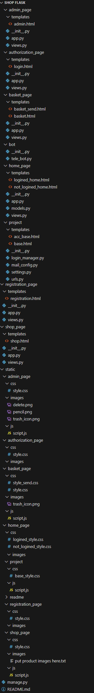

# Flask Shop проект / Flask Shop project
#### Проєкт, який створенний для продажу різноманітного товару з великою зручністю! / A project that was created to sell a variety of goods with great convenience!
#### Для ваших покупців буде доступний зручний інтерфейс для покупки будь якого товару які будуть додані вами / A convenient interface will be available for your customers to purchase any product added by you

#### Для вас же буде доступний широкий вибір інструментів для модерування сайту навіть з телефону за допомогою телеграму! / A wide selection of site moderation tools will be available to you even from your phone using Telegram!

---

### Для більш наглядного і зручного ознайомлення пропонуємо переглянути [демо версію проекту](http://makster.pythonanywhere.com/)  / For a more visual and convenient introduction, we suggest viewing the [demo version of the project](http://makster.pythonanywhere.com/)

<!--  -->

https://github.com/TereshonokMaksim/Shop-Flask/assets/121506340/b1c6a289-0483-491b-bb88-1414d6b57a63

_оскільки це демо версія, то багато функцій буде пропущено. Для того щоб побачити повний функціонал пропонуємо вам викласти цей проект як буде сказано нижче_ / _since this is a demo version, many features will be missed. In order to see the full functionality, we suggest you lay out this project as described below_

---

## Склад нашої команди / The composition of our team :
0. [Микола Скрипник](https://github.com/Nikolay2012) - Створив дизайн для всього нашого сайту
1. [Терешонок Максим](https://github.com/TereshonokMaksim) - Тімлід команди / Team leader
2. [Агеев Данило](https://github.com/Ageev-Danilo) - Активний написач коду - Подяка за активну працю / Active code writer - Thanks for your active work
3. [Овчаренко Юлія](https://github.com/JuliaOvcarenko) - Єдина працівниця - Подяка за старанну працю / The only worker - Thanks for your hard work
4. [Єрмаченков Пересвет](https://github.com/PeresvietErmachenkov) - Працював над кодом проекту - Подяка за старанну працю / Worked on the code for the project - Thanks for your hard work
5. [Ткачук Глєб](https://github.com/Gleb-Tkachuk) - Працівник / Worker 
6. [Литвиненко Христина](https://github.com/LitvinenkoKristina1) - Працювала / Worked

---

## Використані технології / Technologies used
### Python 
#### Наша основна мова програмування на якій написан увесь бекенд проекту / Our main programming language in which the entire backend of the project is written
_нижче приведені фреймворки які були використані при написанні сайту_ / _below are the frameworks that were used when writing the site_
1. >Flask - Головний фреймворк для написання будови сайту / Flask - The main framework for writing the site structure
2. >telebot - Головний фреймворк який відповідає за роботу боту у [Telegram](https://telegram.org/) / telebot - The main framework responsible for the operation of the bot in [Telegram](https://telegram.org/)
### HTML5 
#### Мова-конструктор, на якому побудована структура всіх веб-сторінок проекту / The design language on which the structure of all web pages of the project is built
### CSS
#### Мова для надання сторінкам стилів і деякого косметичного функціоналу / A language for giving pages styles and some cosmetic functionality
### JavaScript
#### Мова для створення сайту фронтенду, функціоналу і краси на сайті для користувача / A language for creating a frontend site, functionality and beauty on the site for the user

---

## Використанні модулі на Python / Using Python modules

```python

flask==3.0.3
# Головний фремворк для створення веб додатку / 
# Main framework for creating a web app

flask_migrate==4.0.7
# Модуль flask який відповідає за проведення міграцій у датабазі. Для роботи потребує flask_sqlalchemy /
# Flask module responsible for migrations in the database. Requires flask_sqlalchemy to work

flask_sqlalchemy==3.1.1
# Модуль flask який відповідає за роботу за датабазою. Для роботи потребує flask_migrate /
# Flask module responsible for working with the database. Requires flask_migrate to work

flask_mail==0.10.0
# Модуль flask який відповідає за роботу з електроною поштою / 
# The flask module is responsible for working with e-mail

flask_login==0.6.3
# Модуль flask який відповідає за роботу с користувачем на сайті / 
# The flask module is responsible for working with the user on the site

telebot==0.0.5
# Фреймворк для створення та управління телеграм  / 
# A framework for creating a Telegram bot

```

---

## Чим може бути корисним цей веб додаток? / How can this web application be useful?
### Для нашої команди створити такий сайт є цінним опитом яким ми і хочемо поділитися з вами! / For our team, creating such a site is a valuable survey that we want to share with you!
#### Якщо ви є програмистом який тільки вчіться, то для вас це буде корисно бо ви зможете вивчити основи роботу з веб додатками, або навіть більше. Також, нижче ви знайдете інструкцію як заливати проект на pythonanywhere.com / If you are a programmer who is just learning, then it will be useful for you because you will be able to learn the basics of working with web applications, or even more. Also, below you will find instructions on how to upload a project to pythonanywhere.com

#### Якщо ви є заказником якому потрібна база для проекту то тут ви зможете отримати повністю функціональний сайт який можна дуже зручно допрацювати для ваших вимог. / If you are a customer who needs a base for a project, here you can get a fully functional site that can be very conveniently modified for your requirements.

---

<details>
<summary>Натисність щоб побачити інструкцію по запуску додатка / Click to see instructions for launching the application </summary>

## Як можна почати користуватись цим веб додатком? / How can I start using this web application?
### Інструкція для локального серверу: / Instructions for the local server:
1. >Завантажте цей файл у необхідну вам папку (зробити це можна за допомогою завантажування ZIP папки після натиснення на зелену кнопку "Code" зверху) / Download this file to the folder you need (you can do this by downloading a ZIP folder after clicking on the green "Code" button above)

2. >Завантажте python по цьому посиланню: https://www.python.org/downloads/ (при завантажуванні на пункті "Додати в PATH" обов'язково поставте галочку!) / Download python from this link: https://www.python.org/downloads/ (be sure to check "Add to PATH" when downloading!)

3. >Завантажте усі модулі які перечисленні вище (у командному рядку (cmd у пошук на комп'ютері) використайте команду pip install {сюди назву модуля}) / Download all the modules listed above (in the command line (search for cmd on the computer) use the command pip install {module name here})

4. >Проведіть міграції. Для цього запустіть проект за допомогою запуску manage.py. Далі, відкрийте командний рядок у папці project (у терміналі це можна зробити за допомогою команди "cd {назва папки}" та повільно перейти у потрібну папку project проекту). Після цього, виконайте наступну послідовність команд у терміналі: / Perform migrations. To do this, run the project using the manage.py run. Next, open a command line in the project folder (in the terminal, you can do this with the command "cd {folder name}" and slowly navigate to the desired project folder of the project). After that, execute the following sequence of commands in the terminal:

```bash
flask --app settings db init
# Для ініціалізації датабази / To initialize the database

flask --app settings db migrate
# Для проведення міграцій датабази / For database migrations

flask --app settings db upgrade
# Для застосування усіх змін датабази / To apply all database changes
```
5. >Запустіть файл manage.py і перейдіть по посиланню http://127.0.0.1:5000/ / Run the file manage.py and go to the link http://127.0.0.1:5000/
6. >Готово! / Done!

### Інструкція для віддаленого серверу: / Instructions for the remote server:
_нижче йде інструкція тільки для www.pythonanywhere.com, для інших використовуйте відповідні інструкції_ / _below are instructions only for www.pythonanywhere.com, for others use the corresponding instructions_

1. >Зареєструйтеся на сайті https://www.pythonanywhere.com / Register at https://www.pythonanywhere.com

2. >У вкладці "Консоль" створіть нову консоль. В ній за допомогою команди git clone (git clone {посилання на GitHub цього проекту с закінченням ".git"} {назва папки у якій буде збережено проект}) завантажте проект. / On the Console tab, create a new console. In it, using the git clone command (git clone {the link to the GitHub of this project with the ending ".git"} {the name of the folder in which the project will be saved}) download the project.

3. >Все ще у консолі за допомогою mkvirtualenv (mkvirtualenv {назва папки для віртуального середовища} --python==python3.10) створіть віртуальне середовище. Далі, за допомогою команди pip (pip install {сюди назву модуля}) завантажити усі модулі які перелічені у списку модулей / Still in the console, use mkvirtualenv (mkvirtualenv {folder name for virtual environment} --python==python3.10) to create a virtual environment. Next, using the pip command (pip install {module name here}) download all the modules that are listed in the list of modules

4. >Далі, у консолі проведіть міграції. Для цього за допомогою команди cd (cd (навза папки)) перейдіть у папку project проекту. Далі, виконайте наступну послідовність команд у терміналі: / Next, perform migrations in the console. To do this, use the cd command (cd (next to the folder)) to go to the project folder of the project. Next, execute the following sequence of commands in the terminal:
```bash
flask --app settings db init
# Для ініціалізації датабази / To initialize the database

flask --app settings db migrate
# Для проведення міграцій датабази / For database migrations

flask --app settings db upgrade
# Для застосування усіх змін датабази / To apply all database changes
```
5. >Далі можна вийти з консолі і у вкладці Web створити додаток. Якщо ви маєте платну підписку ви можете задати свій домен, але це необов'язково. Потім, вибираємо у списку фрейморків Flask і потім Python 3.10. В шлях до головного вставте шлях до файлу manage.py у папці проекту (можна побачити у вкладці Files). / Next, you can exit the console and create an application in the Web tab. If you have a paid subscription, you can specify your domain, but this is optional. Then, select Flask and then Python 3.10 from the list of frameworks. In the main path, paste the path to the manage.py file in the project folder (can be seen in the Files tab).

6. >У проекті задайте початкову директорію (Source Code) таку ж яка вказана у робочій, якщо це ще не зроблено. У пункті WSGI configuration file відкриваємо файл та на 16 рядку (або ж на останньому) заміняємо flask_app на project і app на project. У virtualenvs треба вставити шлях до папки з віртуальним оточенням (можна отримати у вкладці Files. Починається завжди у .virtualenvs) / In the project, set the initial directory (Source Code) to the same one specified in the working one, if it has not been done yet. In the WSGI configuration file item, open the file and on the 16th line (or the last one) replace flask_app with project and app with project. In virtualenvs, you need to insert the path to the folder with the virtual environment (you can get it in the Files tab. It always starts with .virtualenvs)

7. >Натисніть на кнопку "Перезавантажити {ваш логін}.pythonanywhere.com / Click on the button "Reset {your login}.pythonanywhere.com

8. >Готово! Ви завантажили свій проект на pythonanywhere! / Done! You have uploaded your project to pythonanywhere!
</details>

<details>
<summary>Натисність щоб побачити пояснення нашого вибору в SQLite3 / Click to see an explanation of our choices in SQLite3</summary>

## Чому ми вибрали саме SQLite3? / Why did we choose SQLite3?

### Для того щоб почати Казати чому саме SQLite3 ми повинні розібратися що таке база даних (датабаза) взагалі. / In order to begin to say why SQLite3, we must understand what a database (database) is in general.
#### Бази даних (БД, датабази) це це структурований набір даних, який зберігається в електронному вигляді. / Databases (DB, databases) are a structured set of data that is stored electronically.
#### Їх частіше всього використовують для збереження, організації та керування даними з метою легкого доступу, пошуку та маніпулювання. / They are most often used to store, organize and manage data for easy access, search and manipulation.
#### Бази даних складаються з таблиць (моделей) в яких по колонкам у рядок зберігаються відповідні дані що і є причиною простого доступу до даних, як було сказано вище. / Databases consist of tables (models) in which relevant data is stored in rows and columns, which is the reason for easy access to data, as mentioned above.

### Тепер, що ж таке SQLite3? / Now, what is SQLite3?
#### SQLite3 був вибран саме за його простоту та зручність. Також, можна з впевненістю сказати що SQLite3 це доволі швидка вбудована база даних. / SQLite3 was chosen precisely for its simplicity and convenience. Also, it is safe to say that SQLite3 is a fairly fast built-in database.
#### Взагалі, SQLite3 ви можете побачити не тільки в нашому проекті, а багато де ще! Це через те що SQLite3 підтримується майже всіма системами для праці з базами даних що роблить його удеякому сенсі універсальним. / In general, you can see SQLite3 not only in our project, but in many other places! This is due to the fact that SQLite3 is supported by almost all systems for working with databases, which makes it somewhat universal.

### А тепер, чому кожна модель містить колонку ID? / Now, why does each model contain an ID column? 
#### Почнемо з того, що таке ID. ID у базах даних виконують роль унікального і фундаментального ідентифікатора для кожного запису у моделях. / Let's start with what an ID is. IDs in databases act as a unique and fundamental identifier for each record in models.
#### Взагалі, ID має багато причин на знаходження у кожній моделі - починаючи з необхідності простої індексації даних і закінчуючи можливістю "зв'язати" декілька моделей, щоб вони могли дуже зручно обмінюватися даними у коді. / In general, ID has many reasons for being in each model - starting from the need for simple data indexing and ending with the ability to "link" several models so that they can very conveniently exchange data in the code.

### Який можна зробити з цього висновок? / What conclusion can be drawn from this?
#### Бази даних є фундаментальним елементом сучасних додатків для організації та зберігання даних. SQLite3 забезпечує простоту використання та легкість інтеграції, роблячи її відмінним вибором для невеликих проектів. ID, як унікальний ідентифікатор, грає ключову роль у забезпеченні цілісності та ефективності роботи бази даних. / Databases are a fundamental element of modern applications for organizing and storing data. SQLite3 provides ease of use and ease of integration, making it an excellent choice for small projects. ID, as a unique identifier, plays a key role in ensuring the integrity and efficiency of the database.

</details>

---

# Опис файлів додатку / Description of application files
## Далі ви побачите опис усіх важливих частин цього веб-додатку / Below you will see a description of all the important parts of this web application

---

<details>
<summary>Натисність щоб побачити структуру проекту / Click to see the project structure </summary>

### Структура проекту / Project structure
#### Нижче приведена структура нашого проекту / Below is the structure of our project


*_page - Папка у якій створен веб додаток і його базові складові (інші є у папці static) / The folder in which the web application and its basic components are created (others are in the static folder)

    app.py - Відповідає за створення і налаштування веб додатків / Responsible for creating and configuring web applications

    views.py - Відповідає за функцію відображення сторінки / Responsible for the page display function

    models.py - Відповідає за моделі (таблиці) у датабазі

    templates - Папка у якій зберігаються усі веб сторінки даного додатку / Folder in which all web pages of this application are stored

        *.html - Відповідає за конструкцію веб сторінки / Responsible for the design of the web page


project - Папка, у якій створено всі складові фундаменту проекту / Folder in which all components of the foundation of the project are created

    login_manager.py - Відповідає за налаштування роботи з акаунтами користувачів / Responsible for setting up work with user accounts

    main_config.py - Відповідає за створення, налаштування електронної пошти для розсилання повідомлень і самі повідомлення / Responsible for creating, configuring e-mail for sending messages and the messages themselves

    settings.py - Відповідає за налаштування головного додатку проекту / Responsible for configuring the project's main application

    urls.py - Відповідає за підключення усіх додатків за відповідними посиланнями і підключення стороніх додатків до головного / Responsible for connecting all applications

    templates - Папка, у якій зберігаються базові шаблони для веб сторінок / A folder that stores basic templates for web pages

        acc_base.html - Відповідає за базову конструкцію сторінок для користувача який вже ввійшов у систему / Responsible for the basic design of pages for a user who has already logged into the system

        base.html - Відповідає за базову конструкцію сторінок на яких користувач ще не ввійшов у систему / Responsible for the basic design of pages on which the user has not yet logged in


static - Папка у якій зберігаються усі статичні файли (js/css/картинки) / Folder in which all static files (js/css/images) are stored


    *_page - Папка яка відповідає за статичні файли вказаного додатка / The folder responsible for the static files of the specified application

        js - Папка, у якій зберігаються усі js скрипти / The folder where all js scripts are stored

            script.js - Файл з скриптом додатку / Application script file

        css - Папка, у якій зберігаються усі css стилі / The folder where all css styles are stored

            styles.css - Файл з стилями додатку / Application styles file

        images - Папка, у якій зберігаються усі зображення / The folder where all images are stored
        
    project - Папка, яка містить все теж саме що й *_page, але його контенти застосуються до всіх додатків / The folder that contains everything is the same as *_page, but its contents

    will be applied to all applications

    readme - Папка, яка містить зображення для цього README.md файлу / The folder that contains the images for this README.md file


manage.py - Файл, який запускає веб додаток і телеграм бота / The file that runs the web application and the Telegram bot

README.md - Файл, котрий ви зараз читаєте. Створенний для пояснювання проекту для оточуючих. / The file you are currently reading. Created to explain the project to others. 

-* - Любий текст, використовується якщо багато папок мають однаковий контекст щоб узагальнити їх / Any text, used if many folders have the same context to summarize them

---

</details>

<details>
<summary>Натисність щоб побачити конструкцію та код основних частин додатку / Click to see the design and code of the main parts of the application </summary>

### Створення головного додатку: / Creating the main application:

```python
import flask, os

# Створення Flask додатку з налаштуваннями / Creating a Flask application with settings
project = flask.Flask(
    import_name = "settings",  # Ім'я імпорту для додатку / Import name for the application
    template_folder = "project/templates",  # Папка з шаблонами / Template folder
    instance_path = os.path.abspath(__file__ + "/.."),  # Абсолютний шлях до папки з екземплярами / Absolute path to the instance folder
    static_folder = "static"  # Папка зі статичними файлами / Static files folder
)
```
#### Цей файл відповідає за налаштування роботи усього проекту, але не бази даних (окрім instance_path) / This file is responsible for configuring the operation of the entire project, but not the database (except for instance_path)
_тут показано тільки створення додатку, не налаштування його_ / _only the creation of the application is shown here, not its configuration_

---

### Створення стороннього додатку (додатку сторінки): / Creating a third-party application (page application):

```python
import flask 

login_app = flask.Blueprint(
    name = "authorization",
    import_name = "app",
    template_folder = "authorization_page/templates",
    static_folder = "static/authorization_page",
    static_url_path = "/authorization/"
)
```
#### Цей файл відповідає за створення стороннього додатку і налаштування його шляхів

_Це є тільки прикладом основаним на authorization-page. Інші файли мають різні імена_ / _This is just an example based on the authorization-page. Other files have different names_

---

### Налаштування стороннього додатку у urls.py / Setting up a third-party application in urls.py

```python
# Імпортуємо сторінку програми / Import modules page of the application
import home_page, authorization_page, registration_page, shop_page, basket_page, admin_page
# Імпортуємо додаток з модуля реєстрації / Import the app from the registration module
import registration_page.app
# Імпортуємо об'єкт проекту з налаштувань / Import the project object from settings
from .settings import project

# Додаємо URL-правило для домашньої сторінки / Add URL rule for the home page
home_page.home_app.add_url_rule(
    rule = "/",  # Шлях для домашньої сторінки / Path for the home page
    view_func = home_page.show_home_page  # Функція відображення домашньої сторінки / Function to display the home page
)

project.register_blueprint(blueprint = home_page.home_app)  # Реєструємо blueprint для домашньої сторінки / Register the blueprint for the home page
```
### Опис
#### Цей файл відповідає за підключення стороннього додатку до головного / This file is responsible for connecting a third-party application to the main one

_Це є тільки прикладом основаним на home-page. Інші файли мають різні імена_ / _This is just an example based on the home-page. Other files have different names_

---

### Налаштування головного додатку: / Settings of the main application:

```python
import flask, os, flask_migrate, flask_sqlalchemy

# Створення Flask додатку з налаштуваннями / Creating a Flask application with settings
project = flask.Flask(
    import_name = "settings",  # Ім'я імпорту для додатку / Import name for the application
    template_folder = "project/templates",  # Папка з шаблонами / Template folder
    instance_path = os.path.abspath(__file__ + "/.."),  # Абсолютний шлях до папки з екземплярами / Absolute path to the instance folder
    static_folder = "static"  # Папка зі статичними файлами / Static files folder
)

# Налаштування URI для бази даних / Setting the database URI
project.config["SQLALCHEMY_DATABASE_URI"] = "sqlite:///data.db"

# Ініціалізація SQLAlchemy з додатком / Initializing SQLAlchemy with the application
database = flask_sqlalchemy.SQLAlchemy(app = project)
# Ініціалізація Flask-Migrate з додатком та базою даних / Initializing Flask-Migrate with the application and database
migrate = flask_migrate.Migrate(app = project, db = database)
```
#### Це повна версія файлу settings з повним налаштуванням основних частин проекту (шляхів) і база даних / This is the full version of the settings file with full configuration of the main parts of the project (paths) and the database

### Налаштування електронної пошти: / E-mail settings:

```python
from .settings import project # Імпортуємо веб додаток з головного файлу
import flask_mail # Імпортуємо модуль з flask для роботи з електроною поштою
from home_page.models import User

# Адреса для відправлення повідомлень / Administration address
ADMINISTRATION_ADRESS = "m.tereshonok2020@gmail.com"
# Пароль для відправки повідомлень / Administration password
ADMINISTRATION_PASSWORD = "gkoi ufje okhw wscv"
# Створюємо список для електронних скриньок адміністрації / We are creating a list for administration email boxes
admin_addresses = []

# Налаштування сервера для надсилання пошти / Configuring the mail server
project.config["MAIL_SERVER"] = "smtp.gmail.com"
project.config["MAIL_PORT"] = 587  # Порт для сервера / Server port
project.config["MAIL_USE_TLS"] = True  # Дозволяємо використання TLS / Allowing use of TLS
project.config["MAIL_USERNAME"] = ADMINISTRATION_ADRESS  # Задаємо пошту / Setting mail
project.config["MAIL_PASSWORD"] = ADMINISTRATION_PASSWORD  # Пароль / Password

# Ініціалізація Flask-Mail з додатком / Initializing Flask-Mail with the application
mail = flask_mail.Mail(app = project)

# Функція для відправки кошика користувачеві / Function to send the basket to the user
def send_basket(mail_user: str, username: str, basket_text: str):
    # Створюємо повідомлення для користувача / Creating message for a user
    message = flask_mail.Message(
        subject = "Ваш кошик",  # Тема листа / Email subject
        recipients = [mail_user],  # Одержувачі / Recipients
        body = f"Привіт, {username}!\n\n Ваше замовлення: \n\n{basket_text}\n\nДякуємо за замовлення, гарного дня!",  # Тіло листа / Email body
        sender = ADMINISTRATION_ADRESS  # Відправник / Sender
    )
    # Створюємо повідомлення для адміністрації / Creating message for the administration
    admin_message = flask_mail.Message(
        subject = "Ваш кошик",  # Тема листа / Email subject
        recipients = admin_addresses,  # Одержувачі / Recipients
        body = f"Користувач {username} оформив нове замовлення.\n\n Його кошик складається з: \n\n{basket_text}\n\nЩоб змінити його статус перейдіть у телеграмі і гілці Кошик.",  # Тіло листа / Email body
        sender = ADMINISTRATION_ADRESS  # Відправник / Sender
    )
    mail.send(message = admin_message) # Відправляємо повідомлення адміністрації / Sending message to administration
    mail.send(message = message) # Відправляємо повідомлення / Sending message

# Функція для відхилення кошика користувача / Function to reject the user's basket
def reject_basket(mail_user: str, username: str):
    # Створюємо повідомлення / Creating message
    message = flask_mail.Message(
        subject = "Статус вашого замовлення",  # Тема листа / Email subject
        recipients = [mail_user],  # Одержувачі / Recipients
        body = f"Привіт, {username}!\n\n Ваше замовлення було відхилено продавцем магазину.\n\nВибачаемося за незручності, гарного дня!",  # Тіло листа / Email body
        sender = ADMINISTRATION_ADRESS  # Відправник / Sender
    )
    mail.send(message = message) # Відправляємо повідомлення / Sending message

# Функція для підтвердження виконання замовлення / Function to confirm order completion
def complete_basket(mail_user: str, username: str):
    # Створюємо повідомлення / Creating message
    message = flask_mail.Message(
        subject = "Статус вашого замовлення",  # Тема листа / Email subject
        recipients = [mail_user],  # Одержувачі / Recipients
        body = f"Привіт, {username}!\n\n Ваше замовлення вже зібрано та відправлено у дорогу!\n\nДякуємо за ваше замовлення, гарного дня!",  # Тіло листа / Email body
        sender = ADMINISTRATION_ADRESS  # Відправник / Sender
    )
    mail.send(message = message) # Відправляємо повідомлення / Sending message

# Функція для надсилання повідомлення про скасування кошику
def cancel_basket(cart):
    # Створюємо повідомлення / Creating message
    message = flask_mail.Message(
        subject = "Скасування вашого замовлення",  # Тема листа / Email subject
        recipients = [cart.email],  # Одержувачі / Recipients
        body = f"Привіт, {cart.name}!\n\n Ви скасували своє замовлення на {len(cart.products.split(' '))} товарів.",  # Тіло листа / Email body
        sender = ADMINISTRATION_ADRESS  # Відправник / Sender
    )
    # Створюємо повідомлення / Creating message
    admin_message = flask_mail.Message(
        subject = "Статус вашого замовлення",  # Тема листа / Email subject
        recipients = admin_addresses,  # Одержувачі / Recipients
        body = f"Користувач {cart.name} скасував своє замовлення.n\nНомер кошику: {cart.id} \nКошик складався з {len(cart.products.split(' '))} товарів. \n\nПовідомлення з телеграму було автоматично видалено.",  # Тіло листа / Email body
        sender = ADMINISTRATION_ADRESS  # Відправник / Sender
    )
    mail.send(message = admin_message) # Відправляємо повідомлення адміністрації / Sending message to administration
    mail.send(message = message) # Відправляємо повідомлення / Sending message
```
#### Цей файл відповідає за повне налаштування роботи електроної пошти проекту та за створення функцій для надсилання самих повідомлень / This file is responsible for fully configuring the project's e-mail functionality and for creating functions for sending the messages themselves

### Налаштування робити з акаунтами користувачів: / Settings to be made with user accounts:

```python
from flask_login import LoginManager # Імпортуємо клас мененджера логіну для 
from .settings import project
from home_page.models import User

# Секретний ключ для додатку / Secret key for the application
project.secret_key = "😎😎😎"

# Ініціалізація LoginManager з додатком / Initializing LoginManager with the application
login_manager = LoginManager(app = project)

# Функція завантаження користувача / User loader function
@login_manager.user_loader
def load_user(id):
    # Повертає користувача за його ID / Returns a user by their ID
    return User.query.get(id)
```
#### Цей файл відповідає за налаштування роботи з акаунтами користувачів і за їх захист (да, таємний ключ саме такий) / This file is responsible for setting up work with user accounts and protecting them (yes, the secret key is exactly that)

### Створення моделей у датабазі:

```python
from project.settings import database # Імпортуємо датабазу / We import the database
from flask_login import UserMixin # Імпортуємо клас для створення класу користувача / # Import the class to create the user class

# Створюємо модель користувача / We create a user model
class User(database.Model, UserMixin):
    # Створюємо колонку id яка автоматично заповнюється при створенні нового користувача / We create an id column that is automatically filled in when a new user is created
    id = database.Column(database.Integer, primary_key = True)
    # Створюємо колонку імені користувача котра обов'язкова повинна бути не пустою / We create a username column, which must not be empty
    name = database.Column(database.String(60), nullable = False)
    # Створюємо колонку EMail користувача котра обов'язкова повинна бути не пустою / We create the user's EMail column, which must not be empty
    email = database.Column(database.String(80), nullable = False)
    # Створюємо колонку паролю користувача котра обов'язкова повинна бути не пустою / We create a user password column, which must not be empty
    password = database.Column(database.String(50), nullable = False)
    # Створюємо колонку чи є користувач адміністратором / We create a column whether the user is an administrator
    admin = database.Column(database.Integer, nullable = True)

    # Створюємо функцію для текстового відображення моделі / We create a function for text display of the model
    def __repr__(self) -> str:
        # Повертаємо строкове значення яке буде відображено на екрані / We return a string value that will be displayed on the screen
        return f"Користувач {self.name} з id {self.id}, email {self.email}\n"
    
# Створюємо модель продукта / We create a product model
class Product(database.Model):
    # Створюємо колонку id яка автоматично заповнюється при створенні нового користувача / We create an id column that is automatically filled in when a new user is created
    id = database.Column(database.Integer, primary_key = True)
    # Створюємо колонку імені продукта котра обов'язкова повинна бути не пустою / We create a product name column, which must not be empty
    name = database.Column(database.String(180), nullable = False)
    # Створюємо колонку вартості продукта котра обов'язкова повинна бути не пустою / We create a product price column, which must not be empty
    price = database.Column(database.Integer, nullable = False)
    # Створюємо колонку опису продукта котра обов'язкова повинна бути не пустою / We create a product description column, which must not be empty
    description = database.Column(database.Text, nullable = False)
    # Створюємо колонку чи є продукт в наявності котра обов'язкова повинна бути не пустою / We create a column whether the product is available, which must not be empty
    in_stock = database.Column(database.Integer, nullable = False)
    # Створюємо колонку знижки продукта / We create a product discount column
    discount = database.Column(database.Integer, nullable = True)
    # Створюємо колонку кількості продукта / We create a product quantity column
    count = database.Column(database.Integer, nullable = True)
    
    # Створюємо функцію для текстового відображення моделі / We create a function for text display of the model
    def __repr__(self) -> str:
        # Повертаємо строкове значення яке буде відображено на екрані / We return a string value that will be displayed on the screen
        return f"Продукт {self.name} з id {self.id}"

# Створюємо модель кошику / We create a basket model
class Cart(database.Model):
    # Створюємо колонку id яка автоматично заповнюється при створенні нового користувача / We create an id column that is automatically filled in when a new user is created
    id = database.Column(database.Integer, primary_key = True)
    # Створюємо колонку id користувача кошика котра обов'язкова повинна бути не пустою / We create a cart user id column, which must not be empty
    user_id = database.Column(database.Integer, nullable = False)
    # Створюємо колонку id продуктів кошика котра обов'язкова повинна бути не пустою / We create a cart product id column, which must not be empty
    products = database.Column(database.Text, nullable = True)
    # Створюємо колонку імені замовника кошика / We create a column for the name of the customer of the shopping cart
    name = database.Column(database.String(80), nullable = True)
    # Створюємо колонку прізвища замовника кошика / We create a column for the name of the customer of the shopping cart
    surname = database.Column(database.String(80), nullable = True)
    # Створюємо колонку номеру телефону замовника кошика / We create a column for the phone number of the customer of the shopping cart
    phone_number = database.Column(database.String(80), nullable = True)
    # Створюємо колонку EMail замовника кошика / We create the EMail column of the customer of the shopping cart
    email = database.Column(database.String(100), nullable = True)
    # Створюємо колонку міста замовника кошика / We create a column of the city of the customer of the cart
    city = database.Column(database.String(40), nullable = True)
    # Створюємо колонку відділення пошти замовника кошика / We create a column for the post office of the customer of the basket
    post_office = database.Column(database.String(60), nullable = True)
    # Створюємо колонку додаткових побажань замовника кошика / We create a column of additional wishes of the customer of the basket
    additional = database.Column(database.Text, nullable = True)
```
#### Цей файл відповідає за створення усіх моделей бази даних у додатку / This file is responsible for creating all the database models in the application

---

</details>


<details>
<summary>Натисність щоб побачити всі шаблони .html з поясненнями до них / Click to see all .html templates with explanations for them </summary>

## Далі будуть наведені html шаблони сторінок з коментарями до них / Next, html page templates with comments on them will be given


### Конструкція сторінки admin.html: / The structure of the admin.html page:

```html
  <!-- Розширення базового шаблону / Extending the base template -->

  <!-- Встановлення заголовку сторінки / Setting the page title -->

  <!-- Блок для підключення додаткових стилів та скриптів / Block for adding additional styles and scripts -->
    <link rel="stylesheet" href="{{ url_for('admin.static', filename='/css/style.css') }}">  <!-- Підключення CSS файлу / Linking CSS file -->
    <script defer src="{{ url_for('admin.static', filename='/js/script.js') }}"></script>  <!-- Підключення JS файлу / Linking JS file -->


  <!-- Блок для основного контенту сторінки / Block for the main content of the page -->
    <button class="new-product">  <!-- Кнопка для додавання нового продукту / Button to add a new product -->
        <p class="new-product-text">ДОДАТИ ПРОДУКТ</p>  <!-- Текст кнопки / Button text -->
        <p class="new-product-image">+</p>  <!-- Значок додавання продукту / Product addition symbol -->
    </button>
      <!-- Цикл для відображення всіх продуктів / Loop to display all products -->
        <div class="product" id="product-{{ product.id }}">  <!-- Контейнер для продукту з унікальним id / Container for the product with a unique id -->
              <!-- Зображення продукту / Product image -->
            <button class="edit-button edit-image-button" id="edit-image-{{ product.id }}">  <!-- Кнопка редагування зображення продукту / Button to edit product image -->
                  <!-- Іконка редагування / Edit icon -->
            </button>
            
            <div class="product-info">  <!-- Контейнер для інформації про продукт / Container for product information -->
                <div class="product-property">  <!-- Властивість продукту / Product property -->
                    <h2 class="product-name" id="name-{{ product.id }}">{{ product.name }}</h2>  <!-- Назва продукту / Product name -->
                    <button class="edit-button edit-name-button" id="edit-name-{{ product.id }}">  <!-- Кнопка редагування назви продукту / Button to edit product name -->
                          <!-- Іконка редагування / Edit icon -->
                    </button>
                </div>
                <div class='block-product-price'>  <!-- Контейнер для ціни продукту / Container for product price -->
                    <div class="product-property">  <!-- Властивість продукту / Product property -->
                        <p class='product-price-crossed' id="price-{{ product.id }}">{{ product.price }} грн</p>  <!-- Перекреслена ціна продукту / Crossed price of the product -->
                        <button class="edit-button edit-price-product" id="edit-price-{{ product.id }}">  <!-- Кнопка редагування ціни продукту / Button to edit product price -->
                              <!-- Іконка редагування / Edit icon -->
                        </button>
                    </div>
                    <div class="product-property">  <!-- Властивість продукту / Product property -->
                        <p class='product-discount-percent' id="discount-{{ product.id }}">Знижка {{ product.discount }}%</p>  <!-- Відсоток знижки продукту / Product discount percentage -->
                        <button class="edit-button edit-discount-button" id="edit-discount-{{ product.id }}">  <!-- Кнопка редагування знижки продукту / Button to edit product discount -->
                              <!-- Іконка редагування / Edit icon -->
                        </button>
                    </div>
                    <p class='product-discount'>{{ (product.price * (100 - product.discount) / 100) | int }} грн</p>  <!-- Ціна продукту після знижки / Product price after discount -->
                </div>
                <button class="add-product button-stock-{{ product.in_stock }}" id='{{ product.id }}'>КУПИТИ</button>  <!-- Кнопка для покупки продукту / Button to buy the product -->
                  <!-- Цикл для відображення всіх властивостей продукту / Loop to display all product properties -->
                    <!-- <p>{{ property }} --- {{ product.description }} --- {{ product.description.split(";") }}</p> -->
                      <!-- Встановлення назви властивості / Setting the property name -->
                    <p class="product-property">{{ property.split(":")[0] }}:</p>  <!-- Назва властивості продукту / Product property name -->
                    <div class="property-block">  <!-- Контейнер для властивостей / Container for properties -->
                          <!-- Встановлення сирого значення властивості / Setting the raw property value -->
                          <!-- Розділення значення властивості / Splitting the property value -->
                        <p class="property" id="property0-{{ product.id }}-{{ property_name }}">{{ property_values[0] }}</p>  <!-- Значення властивості продукту / Product property value -->
                        <button class="edit-button property-edit-product" id="edit-property0-{{ product.id }}-{{ property_name }}">  <!-- Кнопка редагування властивості продукту / Button to edit product property -->
                              <!-- Іконка редагування / Edit icon -->
                        </button>
                        <p class="property selected-property" id="property1-{{ product.id }}-{{ property_name }}">{{ property_values[1] }}</p>  <!-- Вибране значення властивості продукту / Selected product property value -->
                        <button class="edit-button property-edit-product" id="edit-property1-{{ product.id }}-{{ property_name }}">  <!-- Кнопка редагування вибраної властивості продукту / Button to edit selected product property -->
                              <!-- Іконка редагування / Edit icon -->
                        </button> 
                        <p class="property" id="property2-{{ product.id }}-{{ property_name }}">{{ property_values[2] }}</p>  <!-- Значення властивості продукту / Product property value -->
                        <button class="edit-button property-edit-product" id="edit-property2-{{ product.id }}-{{ property_name }}">  <!-- Кнопка редагування властивості продукту / Button to edit product property -->
                              <!-- Іконка редагування / Edit icon -->
                        </button>
                    </div>
                
                <form method="post">  <!-- Форма для видалення продукту / Form to delete a product -->
                    <button class="product-delete" value="{{ product.id }}" name="delete_product">  <!-- Кнопка видалення продукту / Button to delete a product -->
                          <!-- Іконка видалення продукту / Product delete icon -->
                        <p class="product-delete-text">ВИДАЛИТИ ТОВАР</p>  <!-- Текст кнопки видалення продукту / Button delete text -->
                    </button>
                </form>
            </div>
        </div>
    
    <div class='blur'>  <!-- Розмитий фон для модального вікна / Blurred background for the modal window -->
        <div class='modal-dialog'>  <!-- Модальне вікно для редагування параметрів / Modal window for editing parameters -->
            <h1 class="modal-header">ЗАДАЙТЕ НОВЕ ЗНАЧЕННЯ ПАРАМЕТРУ</h1>  <!-- Заголовок модального вікна / Modal window header -->
            <form method="post" class="send-form" enctype="multipart/form-data">  <!-- Форма для відправки нових значень параметрів / Form to submit new parameter values -->
                <input type="text" name="new-value" class="modal-input" style="display: none;">  <!-- Поле для введення нового значення параметру / Field to input new parameter value -->
                <div class="image-modal-input" style="display: none;">  <!-- Контейнер для введення зображення / Container for image input -->
                    <input type="file" accept="images/*" class="modal-input-image" name="new-value">  <!-- Поле для вибору файлу зображення / File input field for image -->
                    <button class="select-image-input" type="button">SELECT A FILE</button>  <!-- Кнопка для вибору файлу / Button to select a file -->
                    <span class="selected-image-input">NO FILE SELECTED</span>  <!-- Текст для відображення вибраного файлу / Text to display selected file -->
                </div>
                <button class="modal-confirm">SEND</button>  <!-- Кнопка для відправки нових значень / Button to submit new values -->
            </form>
        </div>
        <div class="modal-window-product">  <!-- Модальне вікно для додавання нового продукту / Modal window for adding a new product -->
            <h1 class="modal-header-product">NEW PRODUCT</h1>  <!-- Заголовок модального вікна для нового продукту / Modal window header for new product -->
            <form method="post" enctype="multipart/form-data" class="new-product-form">  <!-- Форма для додавання нового продукту / Form to add a new product -->
                <p class="description-input-product">IMAGE PRODUCT:</p>  <!-- Опис поля для зображення продукту / Description for product image field -->
                <div class="image-modal-input">  <!-- Контейнер для введення зображення продукту / Container for product image input -->
                    <input type="file" id="new-image-input" accept="images/*" class="modal-input-image" required name='product_image'>  <!-- Поле для вибору зображення продукту / File input field for product image -->
                    <button class="select-image-input" id="new-image-button" type="button">SELECT A FILE</button>  <!-- Кнопка для вибору файлу / Button to select a file -->
                    <span class="selected-image-input" id="new-image-name">NO FILE SELECTED</span>  <!-- Текст для відображення вибраного файлу / Text to display selected file -->
                </div>
                <p class="description-input-product">NAME PRODUCT:</p>  <!-- Опис поля для назви продукту / Description for product name field -->
                <input type="text" class="text-input-product" name='product_name'>  <!-- Поле для введення назви продукту / Input field for product name -->
                <p class="description-input-product">DESCRIPTION PRODUCT:</p>  <!-- Опис поля для опису продукту / Description for product description field -->
                <textarea class="text-input-product textarea-product" required name='product_description'></textarea>  <!-- Поле для введення опису продукту / Textarea for product description -->
                <p class="description-input-product">PRICE PRODUCT:</p>  <!-- Опис поля для ціни продукту / Description for product price field -->
                <input type="number" min="0" required class="text-input-product" name='product_price'>  <!-- Поле для введення ціни продукту / Input field for product price -->
                <p class="description-input-product">DISCOUNT PRODUCT:</p>  <!-- Опис поля для знижки продукту / Description for product discount field -->
                <input type="number" min="0" max="100" required class="text-input-product" name='product_discount'>  <!-- Поле для введення знижки продукту / Input field for product discount -->
                <p class="description-input-product">COUNT PRODUCT:</p>  <!-- Опис поля для кількості продукту / Description for product count field -->
                <input type="number" min="0" required class="text-input-product" name='product_count'>  <!-- Поле для введення кількості продукту / Input field for product count -->
                <button class="modal-confirm" name="new_product" value="true">SEND</button>  <!-- Кнопка для відправки даних нового продукту / Button to submit new product data -->
            </form>
        </div>
    </div>

```
#### Форма new-product-form при заповненні і надсиланні створює новий продукт у датабазі / Form new-product-form when filled and sent, creates a new product in the database
#### Форма send-form при заповненні і надсиланні замінює значення того параметру який був вибран користувачем при редагуванні товару / The send-form form, when filled out and sent, replaces the value of the parameter that was selected by the user when editing the product
#### Форма з кнопкою "delete-button" при надсиланні даних (тобто при натисканні на відповідну кнопку) видаляє відповідний товар - A form with a "delete-button" button when sending data (that is, when clicking on the corresponding button) deletes the corresponding product

### Конструкція шаблону authorization.html: / The structure of the authorization.html template: / The structure of the authorization.html template: / The structure of the authorization.html template:
```html
  <!-- Розширення базового шаблону для сторінки авторизації / Extending the base template for the authorization page -->

  <!-- Встановлення заголовку сторінки авторизації / Setting the page title for the authorization page -->

  <!-- Блок для підключення додаткових стилів / Block for adding additional styles -->
    <link rel="stylesheet" href="{{ url_for('authorization.static', filename='/css/style.css') }}">  <!-- Підключення CSS файлу для сторінки авторизації / Linking CSS file for the authorization page -->


  <!-- Блок для основного контенту сторінки / Block for the main content of the page -->
    <p class="main-header"> AUTHORIZATION </p>  <!-- Заголовок сторінки авторизації / Header for the authorization page -->
    <div class="login-bg">  <!-- Фон для форми логіну / Background for the login form -->
        <form method="post">  <!-- Форма для відправки даних авторизації / Form for submitting authorization data -->
            <ul class="login-list">  <!-- Список полів для логіну / List of login fields -->
                <li class='login-element'>  <!-- Елемент списку для логіну або email / List element for login or email -->
                    <p class="login-text">Login or Email</p>  <!-- Текст для поля логіну або email / Text for the login or email field -->
                    <input type="text" class="login-input" name="name" required>  <!-- Поле для введення логіну або email / Input field for login or email -->
                </li>
                <li class='login-element'>  <!-- Елемент списку для пароля / List element for password -->
                    <p class="login-text">Password</p>  <!-- Текст для поля пароля / Text for the password field -->
                    <input type="text" class="login-input" name="pasword">  <!-- Поле для введення пароля / Input field for password -->
                </li>
                <li class='login-element login-el-button'>  <!-- Елемент списку для кнопки відправки / List element for submit button -->
                    <button type="submit" class="login-button">SEND</button>  <!-- Кнопка відправки форми / Submit button for the form -->
                </li>
            </ul>
        </form>
    </div>

      <!-- Перевірка, якщо користувач не зареєстрований / Check if the user is not registered -->
        <div class="dimmer"></div>  <!-- Фон затемнення для модального вікна / Dimmer background for the modal window -->
        <div class="not-registrated-bg">  <!-- Фон для повідомлення про незареєстрованого користувача / Background for the unregistered user message -->
            <h2 class="not-registrated-header"> YOU ARE NOT REGISTERED </h2>  <!-- Повідомлення про незареєстрованого користувача / Message about unregistered user -->
            <a href="/registration/" class="not-registrated-link">  <!-- Посилання на сторінку реєстрації / Link to the registration page -->
                <p class="not-reg-arrow">--> </p>  <!-- Стрілка, що вказує на посилання реєстрації / Arrow pointing to the registration link -->
                <p class="not-reg-text">REGISTRATION</p>  <!-- Текст посилання на реєстрацію / Registration link text -->
            </a>
        </div>
    
    

```
#### Єдина форма у цьому шаблоні (12 лінія) віповідає за надсилання даних про авторизацію користувача (введенний логін і пароль) / The only form in this template (line 12) tells about sending user authorization data (entered login and password)

### Конструкція шаблону basket_send.html: / Structure of the basket_send.html template:
```html
  <!-- Розширення базового шаблону / Extending the base template -->

  <!-- Встановлення заголовку сторінки / Setting the page title -->

  <!-- Блок для підключення стилів / Block for adding styles -->
    <link rel="stylesheet" href="{{ url_for('basket.static', filename='/css/style_send.css') }}">  <!-- Підключення CSS файлу для сторінки кошика / Linking CSS file for the basket page -->


  <!-- Блок для основного контенту сторінки / Block for the main content of the page -->
    <h1 class="page-header">ВАШІ ДАНІ У ОБРОБЦІ<br>КОНСУЛЬТАНТ ЗВ'ЯЖЕТЬСЯ З ВАМИ ДЛЯ ПІДТВЕРДЖЕННЯ ЗАМОВЛЕННЯ</h1>  <!-- Заголовок сторінки з інформацією про обробку даних / Header with information about data processing -->
    <div class="all-products">  <!-- Контейнер для усіх товарів / Container for all products -->
        
            <div class="product" id='product-{{ product[0].id }}'>  <!-- Блок для кожного товару / Block for each product -->
                  <!-- Зображення товару / Product image -->
                <h1 class="product-name">{{ product[0].name }}</h1>  <!-- Назва товару / Product name -->
                <div class="product-count">  <!-- Кількість товару / Product count -->
                    <button class="button-increase button-product" id='increase-{{ product[0].id }}'>+</button>  <!-- Кнопка збільшення кількості товару / Increase button -->
                    <p class="text-product-count" id='count-{{ product[0].id }}'> {{ product[1] }}</p>  <!-- Кількість одиниць товару / Product quantity -->
                    <button class="button-delete button-product" id='delete-{{ product[0].id }}'>-</button>  <!-- Кнопка видалення товару / Delete button -->
                </div>
                <div class='block-product-price'>  <!-- Блок ціни товару / Product price block -->
                    
                        <p class="product-price" id='price-{{ product[0].id }}'>{{ product[0].price }} грн</p>  <!-- Ціна без знижки / Price without discount -->
                    
                        <p class='product-price' id='price-{{ product[0].id }}'>{{ (product[0].price * (100 - product[0].discount) / 100) | int }} грн</p>  <!-- Ціна зі знижкою / Price with discount -->
                    
                </div>
            </div>
        
    </div>
    <div class="overall-price-block block-price-products">  <!-- Блок для загальної вартості замовлення / Block for overall order price -->
        <p class="price-text">Загальна вартість замовлення: </p>  <!-- Текст загальної вартості / Total order price text -->
        <p class="overall-price">{{ ((all_price - all_discount) * 100)|round / 100 }} грн</p>  <!-- Загальна вартість з урахуванням знижки / Total price with discount -->
    </div>
    <form method="post">  <!-- Форма для відправки даних / Form for submitting data -->
        <button class="cancel-button" name="cancel_delivery">  ВІДМІНИТИ ЗАМОВЛЕННЯ  </button>  <!-- Кнопка для відміни замовлення / Button to cancel order -->
    </form>

```
#### Єдина форма у цьому шаблоні відповідає за скасування замовлення при натисканні на відповідну кнопку / The only form in this template is responsible for canceling the order when you click on the corresponding button
#### Цей шаблон з'являється якщо користувач вже оформив замовлення / This template appears if the user has already placed an order

### Конструкція шаблону basket.html: / The design of the basket.html template:
```html
  <!-- Розширення базового шаблону / Extending the base template -->

  <!-- Встановлення заголовку сторінки / Setting the page title -->

  <!-- Блок для підключення стилів та скриптів / Block for adding styles and scripts -->
    <link rel="stylesheet" href="{{ url_for('basket.static', filename='/css/style.css') }}">  <!-- Підключення CSS файлу для стилів / Linking CSS file for styles -->
    <script defer src="{{ url_for('basket.static', filename='/js/script.js') }}"></script>  <!-- Підключення скрипту для сторінки / Linking script for the page -->


  <!-- Блок для основного контенту сторінки / Block for the main content of the page -->
    <div class="all-products">  <!-- Контейнер для всіх товарів / Container for all products -->
        
            <div class="product" id='product-{{ product[0].id }}'>  <!-- Блок для кожного товару / Block for each product -->
                  <!-- Зображення товару / Product image -->
                <h1 class="product-name">{{ product[0].name }}</h1>  <!-- Назва товару / Product name -->
                <div class="product-count">  <!-- Кількість товару / Product count -->
                    <button class="button-reduce button-product" id='reduce-{{ product[0].id }}'>-</button>  <!-- Кнопка зменшення кількості товару / Decrease button -->
                    <p class="text-product-count" id='count-{{ product[0].id }}'> {{ product[1] }}</p>  <!-- Кількість одиниць товару / Product quantity -->
                    <button class="button-increase button-product" id='increase-{{ product[0].id }}'>+</button>  <!-- Кнопка збільшення кількості товару / Increase button -->
                    <button class="button-delete button-product" id='delete-{{ product[0].id }}'>  <!-- Кнопка видалення товару з іконкою кошика / Delete button with trash icon -->
                        
                    </button>
                </div>
                <div class='block-product-price'>  <!-- Блок ціни товару / Product price block -->
                    
                        <p class="product-price" id='price-{{ product[0].id }}'>{{ product[0].price }} грн</p>  <!-- Ціна без знижки / Price without discount -->
                    
                        <p class='product-discount' id='discount-{{ product[0].id }}'>{{ (product[0].price * (100 - product[0].discount) / 100) | int }} грн</p>  <!-- Ціна зі знижкою / Price with discount -->
                        <p class='product-discount-percent'>Знижка {{ product[0].discount }}%</p>  <!-- Відсоток знижки / Discount percentage -->
                        <p class='product-price-crossed' id='price-{{ product[0].id }}'>{{ product[0].price }} грн</p>  <!-- Ціна без знижки перекреслена / Crossed-out price -->
                    
                </div>
            </div>
        
    </div>
    <div class='purchase-confirmation'>  <!-- Блок підтвердження покупки / Purchase confirmation block -->
        <button type="button" class="confirmation-button"> ПЕРЕЙТИ ДО ОФОРМЛЕННЯ </button>  <!-- Кнопка для переходу до оформлення замовлення / Button to proceed to checkout -->
        <div class="price-all-products block-price-products">  <!-- Блок для загальної вартості всіх товарів / Block for total price of all products -->
            <p class="price-text all-products-text">{{ number_of_products }}-и товари на суму</p>  <!-- Текст про кількість товарів і загальну суму / Text about number of products and total amount -->
            <p class="price-products all-products-price">{{ ((all_price) * 100)|round / 100 }} грн</p>  <!-- Загальна вартість всіх товарів / Total price of all products -->
        </div>
        <div class="price-sale block-price-products">  <!-- Блок для суми знижки / Block for discount amount -->
            <p class="price-text">Знижка</p>  <!-- Текст про знижку / Text about discount -->
            <p class="price-products discount-price">{{ ((all_discount) * 100)|round / 100 }} грн</p>  <!-- Сума знижки / Discount amount -->
        </div>
        <div class="overall-price-block block-price-products">  <!-- Блок для загальної суми замовлення / Block for total order amount -->
            <p class="overall-text price-text">Загальна сума</p>  <!-- Текст про загальну суму / Text about total amount -->
            <p class="price-products overall-price">{{ ((all_price - all_discount) * 100)|round / 100 }} грн</p>  <!-- Загальна сума з урахуванням знижки / Total order amount with discount -->
        </div>
    </div>
    <div class="blur">  <!-- Ефект розмиття / Blur effect -->
        <div class="modal-window">  <!-- Модальне вікно для оформлення замовлення / Modal window for order processing -->
            <h1 class="modal-header">ОФОРМЛЕННЯ ЗАМОВЛЕННЯ</h1>  <!-- Заголовок модального вікна / Modal window header -->
            <form class="input-form" method="post">  <!-- Форма для введення даних / Form for entering data -->
                <p class="name-input">ІМ'Я:</p>  <!-- Поле для введення імені / Name input field -->
                <input type="text" class="modal-input" name="name" required>
                <p class="name-input">ПРІЗВИЩЕ:</p>  <!-- Поле для введення прізвища / Surname input field -->
                <input type="text" class="modal-input" name="surname" required>
                <p class="name-input">ТЕЛЕФОН ЗАМОВНИКА:</p>  <!-- Поле для введення телефону / Phone number input field -->
                <input type="text" class="modal-input" name="phone_number" required>
                <p class="name-input">EMAIL ЗАМОВНИКА:</p>  <!-- Поле для введення email / Email input field -->
                <input type="text" class="modal-input" name="email" required>
                <p class="name-input">МІСТО ОТРИМУВАЧА:</p>  <!-- Поле для введення міста / City input field -->
                <input type="text" class="modal-input" name="city" required>
                <p class="name-input">ВІДДІЛЕННЯ НОВОЇ ПОШТИ:</p>  <!-- Поле для введення відділення Нової пошти / Nova Poshta branch input field -->
                <input type="text" class="modal-input" name="post_office" required>
                <p class="name-input">ДОДАТКОВІ ПОБАЖАННЯ:</p>  <!-- Поле для додаткових побажань / Additional requests input field -->
                <textarea name="additional" class="modal-input modal-textarea"></textarea>
                <button class="modal-button" type="submit" name="submit_delivery">SEND</button>  <!-- Кнопка для відправки даних форми / Button for sending form data -->
            </form>
        </div>
    </div>

```
#### Форма "input-form" відповідає за надсилання даних замовника / The "input-form" form is responsible for sending customer data 
#### Цей шаблон з'являється якщо користувач ще не оформив своє замовлення / This template appears if the user has not placed an order yet

### Конструкція шаблону not_logined_home.html / Design of the not_logined_home.html template

```html
  <!-- Розширення базового шаблону / Extending the base template -->

  <!-- Встановлення заголовку сторінки / Setting the page title -->

  <!-- Блок для підключення стилів / Block for adding styles -->
    <link rel="stylesheet" href="{{ url_for('home.static', filename='/css/logined_style.css') }}">  <!-- Підключення CSS файлу для стилів / Linking CSS file for styles -->


  <!-- Блок для основного контенту сторінки / Block for the main content of the page -->
    <div class="content-space">  <!-- Контейнер для контенту / Container for content -->
        <h1 class="main-header">HOME PAGE</h1>  <!-- Заголовок головної сторінки / Main page header -->
    </div>

```
#### Цей шаблон показується якщо користувач вже ввійшов в акаунт / This template is displayed if the user is already logged into the account

_тут немає форм для опису_ / _there are no forms to describe_

### Конструкція шаблону not_logined_home.html / Design of the not_logined_home.html template

```html
  <!-- Розширення базового шаблону / Extending the base template -->

  <!-- Встановлення заголовку сторінки / Setting the page title -->

  <!-- Блок для підключення стилів / Block for adding styles -->
    <link rel="stylesheet" href="{{ url_for('home.static', filename='/css/not_logined_style.css') }}">  <!-- Підключення CSS файлу для стилів / Linking CSS file for styles -->


  <!-- Блок для основного контенту сторінки / Block for the main content of the page -->
    <nav class="right-top-nav">  <!-- Навігаційне меню зверху справа / Navigation menu on the top right -->
        <a href="/registration/" class="nav-link"> REGISTRATION </a>  <!-- Посилання на сторінку реєстрації / Link to registration page -->
        <a href="/authorization/" class="nav-link"> AUTHORIZATION </a>  <!-- Посилання на сторінку авторизації / Link to authorization page -->
    </nav>
    <h1 class="main-header"> HOME PAGE </h1>  <!-- Заголовок головної сторінки / Main page header -->

```
#### Цей шаблон показується якщо користувач ще не ввійшов в акаунт / This template is displayed if the user is not yet logged into the account

_тут немає форм для опису_ / _there are no forms to describe_

### Конструкція шаблону acc_base.html / Construction of the acc_base.html template

```html
<html lang="en"> <!-- Визначення мови сторінки як англійська / Define the language of the page as English -->
    <head> <!-- Відкриття тега head, який містить метадані документа / Opening head tag, which contains the document's metadata -->
        <meta charset="UTF-8"> <!-- Встановлення кодування символів документа як UTF-8 / Setting the character encoding of the document to UTF-8 -->
        <meta name="viewport" content="width=device-width, initial-scale=1.0"> <!-- Встановлення параметрів viewport для коректного відображення на різних пристроях / Setting the viewport parameters for proper display on various devices -->
        <title>{{ page_title }}</title> <!-- Встановлення заголовку сторінки, який буде відображено у вкладці браузера / Setting the page title, which will be displayed in the browser tab -->
         <!-- Початок блоку для додавання додаткових посилань / Start of a block to add additional links -->
         <!-- Кінець блоку для додавання додаткових посилань / End of a block to add additional links -->
    </head> <!-- Закриття тега head / Closing head tag -->
    <body> <!-- Відкриття тега body, який містить основний вміст документа / Opening body tag, which contains the main content of the document -->
         <!-- Початок блоку для додавання основного вмісту / Start of a block to add main content -->
         <!-- Кінець блоку для додавання основного вмісту / End of a block to add main content -->
    </body> <!-- Закриття тега body / Closing body tag -->
</html> <!-- Закриття тега html / Closing html tag -->
```
#### Тут створена базовий шаблон, тобто те, с чого точно складається кожна сторінка. / A basic template is created here, that is, what exactly each page consists of.
#### Цей шаблон використовується у шаблонах які працюють з користувачем який ще не ввійшов. / This template is used in templates that work with a user who has not yet logged in.

### Конструкція шаблону base.html / Construction of the base.html template
```html
<html lang="en"> <!-- Визначення мови сторінки як англійська / Define the language of the page as English -->
    <head> <!-- Відкриття тега head, який містить метадані документа / Opening head tag, which contains the document's metadata -->
        <meta charset="UTF-8"> <!-- Встановлення кодування символів документа як UTF-8 / Setting the character encoding of the document to UTF-8 -->
        <meta name="viewport" content="width=device-width, initial-scale=1.0"> <!-- Встановлення параметрів viewport для коректного відображення на різних пристроях / Setting the viewport parameters for proper display on various devices -->
        <title>{{ page_title }}</title> <!-- Встановлення заголовку сторінки, який буде відображено у вкладці браузера / Setting the page title, which will be displayed in the browser tab -->
        <link rel="stylesheet" href="{{ url_for('static', filename = 'project/css/base_style.css')}}"> <!-- Підключення файлу CSS для стилізації сторінки / Linking CSS file for styling the page -->
        <script defer src = "{{ url_for('static', filename = 'project/js/script.js') }}" type = "module"></script> <!-- Підключення файлу JavaScript з відкладеним виконанням / Linking JavaScript file with deferred execution -->
         <!-- Початок блоку для додавання додаткових посилань / Start of a block to add additional links -->
         <!-- Кінець блоку для додавання додаткових посилань / End of a block to add additional links -->
    </head> <!-- Закриття тега head / Closing head tag -->
    <header> <!-- Відкриття тега header, який містить заголовок сторінки / Opening header tag, which contains the page header -->
        <div class = "main-info"> <!-- Відкриття блоку для основної інформації / Opening div for main information -->
            <a class = "main-text main-home" href = "/">HOME</a> <!-- Посилання на головну сторінку / Link to the home page -->
            <a class = "main-text main-shop" href = "/shop/">SHOP</a> <!-- Посилання на магазин / Link to the shop -->
            <div class = "main-text main-basket"> <!-- Відкриття блоку для корзини / Opening div for the basket -->
                <a class = "main-text main-basket" href = "/basket/">BASKET</a> <!-- Посилання на корзину / Link to the basket -->
                <p class = "basket-count" id = "basket-counter"></p> <!-- Параграф для відображення кількості товарів у корзині / Paragraph to display the number of items in the basket -->
            </div> <!-- Закриття блоку для корзини / Closing div for the basket -->
            <a class = "main-text main-contacts" href = "/contacts/">CONTACTS</a> <!-- Посилання на сторінку контактів / Link to the contacts page -->
             <!-- Перевірка, чи є користувач адміністратором / Check if the user is an admin -->
                <a class="main-text main-admin" href="/admin/">ADMIN</a> <!-- Посилання на сторінку адміністрування / Link to the admin page -->
             <!-- Кінець перевірки, чи є користувач адміністратором / End of the admin check -->
        </div> <!-- Закриття блоку для основної інформації / Closing div for main information -->
        <div class = "username-info"> <!-- Відкриття блоку для інформації про користувача / Opening div for user information -->
            <p class = "main-text username">{{ username|upper }}</p> <!-- Відображення імені користувача у верхньому регістрі / Displaying the username in uppercase -->
        </div> <!-- Закриття блоку для інформації про користувача / Closing div for user information -->
    </header> <!-- Закриття тега header / Closing header tag -->
    <body> <!-- Відкриття тега body, який містить основний вміст документа / Opening body tag, which contains the main content of the document -->
        <div class = "content"> <!-- Відкриття блоку для вмісту сторінки / Opening div for the page content -->
             <!-- Початок блоку для додавання основного вмісту / Start of a block to add main content -->
             <!-- Кінець блоку для додавання основного вмісту / End of a block to add main content -->
        </div> <!-- Закриття блоку для вмісту сторінки / Closing div for the page content -->
    </body> <!-- Закриття тега body / Closing body tag -->
</html> <!-- Закриття тега html / Closing html tag -->
```
#### Тут створена базовий шаблон, тобто те, с чого точно складається кожна сторінка. / A basic template is created here, that is, what exactly each page consists of.
#### Цей шаблон використовується у шаблонах які працюють з користувачем який вже ввійшов. / This template is used in templates that work with a user who has logged in.

### Конструкція шаблону registration.html: / Construction of the registration.html template:

```html
  <!-- Розширення базового шаблону / Extending the base template -->

  <!-- Встановлення заголовку сторінки / Setting the page title -->

  <!-- Блок для підключення стилів / Block for adding styles -->
    <link rel="stylesheet" href="{{ url_for('registration.static', filename='/css/style.css') }}">  <!-- Підключення CSS файлу для стилів / Linking CSS file for styles -->


  <!-- Блок для основного контенту сторінки / Block for the main content of the page -->
    <p class="main-header"> REGISTRATION </p>  <!-- Заголовок сторінки реєстрації / Registration page header -->
    <div class="registration-bg">  <!-- Фоновий блок для реєстрації / Background block for registration -->
        <form method="post">  <!-- Форма для відправки даних / Form for data submission -->
            <ul class='registration-list'>  <!-- Список елементів реєстрації / List of registration elements -->
                <li class='registration-el'>
                    <p class='registration-text'> Login </p>  <!-- Текстове поле для введення логіна / Text field for entering login -->
                    <input type="text" class='registration-input' name="name">
                </li>
                <li class='registration-el'>
                    <p class='registration-text'> Email </p>  <!-- Текстове поле для введення email / Text field for entering email -->
                    <input type="text" class='registration-input' name="email">
                </li>
                <li class='registration-el'>
                    <p class='registration-text'> Password </p>  <!-- Текстове поле для введення пароля / Text field for entering password -->
                    <input type="text" class='registration-input' name="password">
                </li>
                <li class='registration-el'>
                    <p class='registration-text'> Password confirmation </p>  <!-- Текстове поле для підтвердження пароля / Text field for confirming password -->
                    <input type="text" class='registration-input' name="password_confirm">
                </li>
                <li class='registration-el registration-el-button'>
                    <button type='submit' class="registration-button">SEND</button>  <!-- Кнопка для відправки форми / Button to submit the form -->
                </li>
            </ul>
        </form>
    </div>
      <!-- Перевірка, чи користувач зареєстрований / Checking if the user is registered -->
        <div class='dimmer'>
        </div>
        <div class='registrated-bg'>
            <h2 class='registrated-header'> CONFIRMED </h2>  <!-- Підтвердження успішної реєстрації / Confirmation of successful registration -->
            <a href="/authorization/" class="registrated-link"> 
                <p class="reg-arrow">--></p>  <!-- Стрілка вправо для навігації / Right arrow for navigation -->
                <p class="reg-text">AUTHORIZATION</p>  <!-- Текст для переходу до авторизації / Text to navigate to authorization -->
            </a>
        </div>
    
    

```
#### Єдина форма тут відповідає за надсиалння даних користувача для регістрації його / The only form here is responsible for submitting the user's data to register him

### Конструкція шаблону shop.html / Design of the shop.html template

```html
  <!-- Розширення базового шаблону / Extending the base template -->

  <!-- Встановлення заголовку сторінки / Setting the page title -->

  <!-- Блок для підключення стилів і скриптів / Block for adding styles and scripts -->
    <link rel="stylesheet" href="{{ url_for('shop.static', filename='/css/style.css') }}">  <!-- Підключення CSS файлу для стилів / Linking CSS file for styles -->
    <script defer src="{{ url_for('shop.static', filename='/js/script.js') }}"></script>  <!-- Підключення JS файлу для скриптів / Linking JS file for scripts -->


  <!-- Блок для основного контенту сторінки / Block for the main content of the page -->
      <!-- Цикл для відображення кожного продукту / Loop to display each product -->
        <div class="product" id="product-{{ product.id }}">  <!-- Контейнер для продукту з унікальним id / Container for each product with unique id -->
              <!-- Зображення продукту / Product image -->
            <div class="product-info">  <!-- Інформація про продукт / Product information -->
                <h2 class="product-name">{{ product.name }}</h2>  <!-- Назва продукту / Product name -->
                
                    <p class="product-price">{{ product.price }} грн</p>  <!-- Ціна продукту без знижки / Product price without discount -->
                
                    <div class='block-product-price'>
                        <p class='product-price-crossed'>{{ product.price }} грн</p>  <!-- Ціна до знижки / Price before discount -->
                        <p class='product-discount-percent'>Знижка {{ product.discount }}%</p>  <!-- Відсоток знижки / Discount percentage -->
                        <p class='product-discount'>{{ (product.price * (100 - product.discount) / 100) | int }} грн</p>  <!-- Ціна після знижки / Price after discount -->
                    </div>
                
                <button class="add-product button-stock-{{ product.in_stock }}" id='{{ product.id }}'>КУПИТИ</button>  <!-- Кнопка для додавання продукту до кошика / Button to add product to cart -->
                
                    <!-- <p>{{ property }} --- {{ product.description }} --- {{ product.description.split(";") }}</p> -->
                    <p class="product-property">{{ property.split(":")[0] }}:</p>  <!-- Властивості продукту / Product properties -->
                    <div class="property-block">
                        
                        
                        <p class="property">{{ property_values[0] }}</p>  <!-- Перша властивість / First property -->
                        <p class="property selected-property">{{ property_values[1] }}</p>  <!-- Вибрана властивість / Selected property -->
                        <p class="property">{{ property_values[2] }}</p>  <!-- Третя властивість / Third property -->
                    </div>
                
                <div class="product-in-stock" id="{{ product.in_stock }}">  <!-- Відображення наявності товару / Displaying product availability -->
                    
                        
                    
                        
                    
                    <p class="in-stock-text">ТОВАР В НАЯВНОСТІ</p>  <!-- Текст про наявність товару / Text indicating product availability -->
                </div>
            </div>
        </div>
    

```
_незважаючи на своє призначення, цей шаблон працює без форм завдяки JS!_ / _despite its purpose, this template works without forms thanks to JS!_

---

</details>

<details>
<summary>Натисність щоб побачити конструкцію та код файлів views з відповідними поясненнями / Click to see the construction and code views files with relevant explanations </summary>

## Далі будуть приведені код файлів views з відповідними поясненнями / Next, the code of the views files will be given with relevant explanations

### Код views.py сторінки адміністрації / The views.py code of the administration page

```python
import flask  # Імпорт бібліотеки Flask / Import the Flask library
from flask_login import current_user  # Імпорт змінної для отримання поточного користувача / Import a variable to get the current user
import os  # Імпорт бібліотеки для роботи з операційною системою / Import the library for operating system tasks
from project.settings import database  # Імпорт налаштувань бази даних з проекту / Import the database settings from the project
from home_page.models import Product, Cart  # Імпорт моделей Product і Cart з модуля home_page / Import the Product and Cart models from the home_page module

def show_admin_page():  # Визначення функції для показу адміністративної сторінки / Define a function to show the admin page
    try:  # Початок блоку обробки виключень / Start of the exception handling block
        if current_user.admin != 0:  # Перевірка, чи користувач є адміністратором / Check if the user is an admin
            if flask.request.method == "POST":  # Перевірка методу запиту / Check the request method
                form_data = dict(flask.request.form)  # Отримання даних форми з запиту / Get form data from the request
                if 'new_product' in form_data.keys():  # Перевірка наявності ключа 'new_product' у формі / Check if 'new_product' key is in the form
                    new_product = Product(  # Створення нового продукту / Create a new product
                        name = form_data['product_name'],  # Встановлення імені продукту / Set the product name
                        description = form_data['product_description'],  # Встановлення опису продукту / Set the product description
                        price = int(form_data['product_price']),  # Встановлення ціни продукту / Set the product price
                        discount = int(form_data['product_discount']),  # Встановлення знижки на продукт / Set the product discount
                        in_stock = 1  # Встановлення наявності продукту в наявності / Set the product as in stock
                        )
                    # Збереження зображення продукту / Save the product image
                    flask.request.files['product_image'].save(dst = os.path.abspath(__file__ + f'/../../static/shop_page/images/{new_product.name}.png'))
                    database.session.add(new_product)  # Додавання нового продукту до сесії бази даних / Add the new product to the database session
                    database.session.commit()  # Фіксація змін у базі даних / Commit the changes to the database

                elif 'delete_product' in form_data.keys():  # Перевірка наявності ключа 'delete_product' у формі / Check if 'delete_product' key is in the form
                    delete_product = Product.query.get(form_data['delete_product'])  # Отримання продукту для видалення з бази даних / Get the product to delete from the database
                    if delete_product != None:  # Перевірка, чи існує продукт / Check if the product exists
                        image_path = os.path.abspath(__file__ + f'/../../static/shop_page/images/{delete_product.name}.png')  # Отримання шляху до зображення продукту / Get the product image path
                        
                        if os.path.exists(image_path):  # Перевірка, чи існує зображення / Check if the image exists
                            os.remove(image_path)  # Видалення зображення продукту / Remove the product image
                        database.session.delete(delete_product)  # Видалення продукту з бази даних / Delete the product from the database
                        database.session.commit()  # Фіксація змін у базі даних / Commit the changes to the database
                else:  # Інші дії з продуктами / Other actions with products
                    if list(flask.request.files.values())[0] != None:  # Перевірка наявності файлів у запиті / Check if files are present in the request
                        input_key = list(form_data.keys())[0]  # Отримання ключа з форми / Get the key from the form
                        value = form_data[input_key]  # Отримання значення з форми / Get the value from the form
                    else:
                        input_key = list(flask.request.files.keys())[0]  # Отримання ключа файлу з запиту / Get the file key from the request
                    print(input_key, input_key)  # Виведення ключа для дебагу / Print the key for debugging
                    product = Product.query.get(input_key.split("-")[2])  # Отримання продукту за ключем / Get the product by key
                    print(form_data, product, input_key.split("-")[2])  # Виведення даних для дебагу / Print the data for debugging
                    if "name" in input_key:  # Перевірка, чи ключ містить 'name' / Check if the key contains 'name'
                        # Перейменування зображення продукту / Rename the product image
                        os.rename(os.path.abspath(__file__ + f"/../../static/shop_page/images/{product.name}.png"), 
                                os.path.abspath(__file__ + f"/../../static/shop_page/images/{value}.png"))
                        product.name = value  # Оновлення імені продукту / Update the product name

                    elif "discount" in input_key:  # Перевірка, чи ключ містить 'discount' / Check if the key contains 'discount'
                        product.discount = int(value)  # Оновлення знижки продукту / Update the product discount
                    elif "price" in input_key:  # Перевірка, чи ключ містить 'price' / Check if the key contains 'price'
                        product.price = round(int(value), 2)  # Оновлення ціни продукту / Update the product price
                    elif "property" in input_key:  # Перевірка, чи ключ містить 'property' / Check if the key contains 'property'
                        product = Product.query.get(input_key.split("-")[-2])  # Отримання продукту за ключем / Get the product by key
                        base_properties = product.description.split(";")  # Розбиття опису продукту на властивості / Split the product description into properties
                        input_data = input_key.split("-")[1:]  # Отримання даних з ключа / Get the data from the key
                        for base_property in base_properties:  # Прохід по базових властивостях / Loop through base properties
                            print(base_property, input_data)  # Виведення властивостей для дебагу / Print properties for debugging
                            if input_data[-1] in base_property:  # Перевірка, чи містить властивість потрібні дані / Check if the property contains the required data
                                print("im in")  # Виведення повідомлення для дебагу / Print a message for debugging
                                new_property = base_property.split(": ")[-1].split("/")  # Розбиття властивості на частини / Split the property into parts
                                new_property[int(input_data[0].replace("property", ""))] = value  # Оновлення властивості новим значенням / Update the property with the new value
                                new_property = "/".join(new_property)  # Об'єднання частин властивості / Join the property parts
                                base_properties[base_properties.index(base_property)] = ": ".join([base_property.split(": ")[0], new_property])  # Оновлення властивості в базі / Update the property in the base
                        print(base_properties)  # Виведення оновлених властивостей для дебагу / Print the updated properties for debugging
                        product.description = "; ".join(base_properties)  # Оновлення опису продукту / Update the product description

                    elif "image" in input_key:  # Перевірка, чи ключ містить 'image' / Check if the key contains 'image'
                        image = flask.request.files["new-value"]  # Отримання нового зображення з запиту / Get the new image from the request
                        path = os.path.abspath(__file__ + f"/../../static/shop_page/images/{product.name}.png")  # Отримання шляху до зображення продукту / Get the product image path
                        if os.path.exists(path):  # Перевірка, чи існує зображення / Check if the image exists
                            os.remove(path)  # Видалення старого зображення / Remove the old image
                        image.save(path)  # Збереження нового зображення / Save the new image
                    print(product)  # Виведення продукту для дебагу / Print the product for debugging

                    database.session.add(product)  # Додавання продукту до сесії бази даних / Add the product to the database session
                    database.session.commit()  # Фіксація змін у базі даних / Commit the changes to the database

            # Повернення шаблону адміністративної сторінки з продуктами / Return the admin page template with products
            return flask.render_template(template_name_or_list = "admin.html", products = Product.query.all(), admin = current_user.admin, username = current_user.name)
        else:  # Якщо користувач не адміністратор, перенаправити на головну сторінку / If the user is not an admin, redirect to the main page
            return flask.redirect(location = "/")
    except Exception as error:  # Обробка винятків / Handle exceptions
        print(f"An error has occured while there was an attempt to load the page.\nError log: {error}")  # Виведення повідомлення про помилку / Print the error message
        return flask.redirect(location = "/")  # Перенаправлення на головну сторінку / Redirect to the main page
```
#### Тут, код реагує на редагування властивостей товару, видалення товару і створення нового / Here, the code reacts to editing product properties, deleting a product and creating a new one

### Код views.py сторінки авторизації / Views.py code of the authorization page

```python
import flask  # Імпорт бібліотеки Flask / Import the Flask library
from home_page.models import User  # Імпорт моделі User з модуля home_page / Import the User model from the home_page module
from flask_login import login_user, current_user  # Імпорт функції для входу користувача та змінної поточного користувача / Import the function to log in a user and the current user variable

def show_login_page():  # Визначення функції для показу сторінки входу / Define a function to show the login page
    print(current_user.is_authenticated)  # Виведення статусу автентифікації поточного користувача / Print the authentication status of the current user
    if flask.request.method == "POST":  # Перевірка методу запиту / Check the request method
        form_data = dict(flask.request.form)  # Отримання даних форми з запиту / Get form data from the request
        print(form_data)  # Виведення даних форми для дебагу / Print the form data for debugging
        for user in [*User.query.filter_by(name = form_data['name']), *User.query.filter_by(email = form_data["name"])]:  # Прохід по користувачах, знайдених за ім'ям або email / Loop through users found by name or email
        login_user(user)  # Вхід користувача / Log in the user
        return flask.redirect("/")  # Перенаправлення на головну сторінку після входу / Redirect to the main page after login
        return flask.render_template(template_name_or_list = "login.html", not_registrated = True)  # Повернення шаблону сторінки входу з помилкою / Return the login page template with an error
    return flask.render_template(template_name_or_list = "login.html")  # Повернення шаблону сторінки входу / Return the login page template
```
#### Тут, код автенфікує користувача в сиситему під акаунтом який ввів користувач / Here, the code identifies the user in the system under the account entered by the user

### Код views.py сторінки кошику / Cart page views.py code

```python
import flask  # Імпорт бібліотеки Flask / Import the Flask library
from home_page.models import Product, Cart  # Імпорт моделей Product та Cart з модуля home_page / Import the Product and Cart models from the home_page module
from flask_login import current_user, UserMixin  # Імпорт поточного користувача та UserMixin з flask_login / Import current user and UserMixin from flask_login
from project.settings import database  # Імпорт налаштувань бази даних з проекту / Import the database settings from the project
from bot import send_cart, delete_cart  # Імпорт функцій send_cart та delete_cart з модуля bot / Import send_cart and delete_cart functions from the bot module
from project.mail_config import cancel_basket

def show_basket_page():  # Визначення функції для показу сторінки кошика / Define a function to show the basket page
    if isinstance(current_user, UserMixin):  # Перевірка, чи поточний користувач є екземпляром UserMixin / Check if the current user is an instance of UserMixin
        unique_product = {}  # Ініціалізація словника для унікальних продуктів / Initialize a dictionary for unique products
        all_price = 0  # Ініціалізація загальної ціни / Initialize total price
        num_products = 0  # Ініціалізація кількості продуктів / Initialize number of products
        all_discount = 0  # Ініціалізація загальної знижки / Initialize total discount
        cookies_products = flask.request.cookies.get("product")  # Отримання продуктів з cookies / Get products from cookies
        print(flask.request.method, "METHOD")  # Виведення методу запиту / Print the request method
        if flask.request.method == "POST":  # Перевірка методу запиту / Check the request method
            form = flask.request.form  # Отримання даних форми з запиту / Get form data from the request
            print(form, "WHERE")  # Виведення даних форми для дебагу / Print the form data for debugging
            if "submit_delivery" in form.keys():  # Перевірка, чи натиснута кнопка "submit_delivery" / Check if the "submit_delivery" button is pressed
                user_cart = Cart(user_id = current_user.id,  # Створення нового об'єкта Cart / Create a new Cart object
                                products = cookies_products,  # Збереження продуктів з cookies / Save products from cookies
                                name = form["name"],  # Збереження імені з форми / Save name from the form
                                surname = form["surname"],  # Збереження прізвища з форми / Save surname from the form
                                phone_number = form["phone_number"],  # Збереження номера телефону з форми / Save phone number from the form
                                email = form["email"],  # Збереження email з форми / Save email from the form
                                city = form["city"],  # Збереження міста з форми / Save city from the form
                                post_office = form["post_office"],  # Збереження поштового відділення з форми / Save post office from the form
                                additional = form["additional"])  # Збереження додаткової інформації з форми / Save additional information from the form
                database.session.add(user_cart)  # Додавання нового об'єкта Cart до сесії бази даних / Add the new Cart object to the database session
                database.session.commit()  # Фіксація змін у базі даних / Commit the changes to the database
                send_cart(cart = user_cart)  # Виклик функції send_cart з новим об'єктом Cart / Call the send_cart function with the new Cart object
            elif "cancel_delivery" in form.keys():  # Перевірка, чи натиснута кнопка "cancel_delivery" / Check if the "cancel_delivery" button is pressed
                for cart in Cart.query.filter_by(user_id = current_user.id): cart_to_delete = cart  # Отримання корзини для видалення / Get the cart to delete
                cancel_basket(cart = cart_to_delete) # Надсилаємо повідомлення на пошту про скасування замовлення / Sending message to the mail about canceling the order
                delete_cart(cart_id = cart_to_delete.id)  # Виклик функції delete_cart з id корзини / Call the delete_cart function with the cart id
                database.session.delete(cart_to_delete)  # Видалення корзини з бази даних / Delete the cart from the database
                database.session.commit()  # Фіксація змін у базі даних / Commit the changes to the database

        if cookies_products != None:  # Перевірка, чи продукти в cookies не є пустими / Check if products in cookies are not empty
            for id_product in cookies_products.split(" "):  # Прохід по кожному продукту в cookies / Loop through each product in cookies
                try:
                    print(id_product)  # Виведення id продукту для дебагу / Print the product id for debugging
                    current_product = Product.query.get(id_product)  # Отримання поточного продукту з бази даних за id / Get the current product from the database by id
                    all_price += current_product.price  # Додавання ціни продукту до загальної ціни / Add the product price to the total price
                    all_discount += int(current_product.price * current_product.discount / 100)  # Додавання знижки продукту до загальної знижки / Add the product discount to the total discount
                    num_products += 1  # Збільшення кількості продуктів на 1 / Increment the number of products by 1
                    if id_product in list(unique_product.keys()):  # Перевірка, чи продукт вже є в унікальних продуктах / Check if the product is already in unique products
                        unique_product[id_product][1] += 1  # Збільшення кількості даного продукту на 1 / Increment the quantity of this product by 1
                    else:
                        unique_product[id_product] = [current_product, 1]  # Додавання нового продукту до унікальних продуктів / Add a new product to unique products
                except:  # Обробка виключень / Handle exceptions
                    print(f"Cookie {id_product} is wrong!")  # Виведення повідомлення про помилковий cookie / Print a message about the wrong cookie
        cart_num = 0  # Ініціалізація кількості корзин / Initialize the number of carts
        for cart in Cart.query.filter_by(user_id = current_user.id):  # Прохід по всіх корзинах користувача / Loop through all user's carts
            cart_num += 1  # Збільшення кількості корзин на 1 / Increment the number of carts by 1
        print(cart_num)  # Виведення кількості корзин для дебагу / Print the number of carts for debugging
        if cart_num == 0:  # Перевірка, чи немає корзин / Check if there are no carts
            template_name = "basket.html"  # Встановлення шаблону "basket.html" / Set the template to "basket.html"
        else:
            template_name = "basket_send.html"  # Встановлення шаблону "basket_send.html" / Set the template to "basket_send.html"

        # Повернення шаблону сторінки з переданими параметрами / Return the template with the passed parameters
        return flask.render_template(template_name_or_list = template_name, 
                                    products = list(unique_product.values()),  # Передача унікальних продуктів / Pass unique products
                                    all_price = all_price,  # Передача загальної ціни / Pass total price
                                    number_of_products = num_products,  # Передача кількості продуктів / Pass number of products
                                    username = current_user.name.upper(),  # Передача імені користувача у верхньому регістрі / Pass the username in uppercase
                                    all_discount = round(all_discount, 2),  # Передача загальної знижки / Pass total discount
                                    admin = current_user.admin)  # Передача статусу адміністратора / Pass admin status
    else:  # Якщо користувач не автентифікований / If the user is not authenticated
        return flask.redirect(location = "/")  # Перенаправлення на головну сторінку / Redirect to the main page
```
#### Тут код реагує на оформлення заказу і відправляє дані телеграм боту щоб той надіслав відповідне повідомлення адміністраторам / Here, the code reacts to placing an order and sends telegram data to the bot so that it sends a corresponding message to the administrators

### Код views.py домашньої сторінки / The home page views.py code
```python
import flask  # Імпорт бібліотеки Flask / Import the Flask library
from flask_login import current_user  # Імпорт змінної поточного користувача з flask_login / Import the current user variable from flask_login

def show_home_page():  # Визначення функції для показу домашньої сторінки / Define a function to show the home page
    if current_user.is_authenticated:  # Перевірка, чи користувач автентифікований / Check if the user is authenticated
        return flask.render_template(  # Повернення шаблону з параметрами / Return the template with parameters
            template_name_or_list="logined_home.html",  # Назва шаблону для автентифікованих користувачів / Template name for authenticated users
            username=current_user.name.upper(),  # Ім'я користувача у верхньому регістрі / User's name in uppercase
            admin=current_user.admin  # Статус адміністратора користувача / User's admin status
        )
    else:  # Якщо користувач не автентифікований / If the user is not authenticated
        return flask.render_template(template_name_or_list="not_logined_home.html")  # Повернення шаблону для неавтентифікованих користувачів / Return the template for non-authenticated users
```
#### Тут код перевіряє чи ввійшов користувач у систему і надсилає відповідний шаблон сторінки / Here the code checks if the user is logged in and sends the appropriate page template

### Код views.py сторінки регістрації / The views.py code of the registration page

```python
import flask  # Імпорт бібліотеки Flask / Import the Flask library
from flask_login import current_user  # Імпорт змінної поточного користувача з flask_login / Import the current user variable from flask_login
from home_page.models import User, database, Cart  # Імпорт моделей User, database та Cart з модуля home_page / Import the User, database, and Cart models from the home_page module

def show_registration_page():  # Визначення функції для показу сторінки реєстрації / Define a function to show the registration page
    print(current_user.is_authenticated)  # Виведення статусу автентифікації поточного користувача / Print the authentication status of the current user
    if flask.request.method == "POST":  # Перевірка методу запиту / Check the request method
        form_data = dict(flask.request.form)  # Отримання даних форми з запиту / Get form data from the request
        print(form_data)  # Виведення даних форми для дебагу / Print the form data for debugging
        # Створення нового користувача з даними з форми / Create a new user with data from the form
        user = User(name=form_data["name"], email=form_data["email"], password=form_data["password"], admin=0)
        is_registered = True  # Позначення, що користувач зареєстрований / Indicate that the user is registered
        database.session.add(user)  # Додавання нового користувача до сесії бази даних / Add the new user to the database session
        database.session.commit()  # Фіксація змін у базі даних / Commit the changes to the database
    else:  # Якщо метод запиту не POST / If the request method is not POST
        is_registered = False  # Позначення, що користувач не зареєстрований / Indicate that the user is not registered

    print(is_registered)  # Виведення статусу реєстрації для дебагу / Print the registration status for debugging
    # Повернення шаблону сторінки реєстрації з параметром is_registered / Return the registration page template with the is_registered parameter
    return flask.render_template(template_name_or_list="registration.html", is_registrated=is_registered)
```
#### Тут код реєструє користувача і каже йому що реєстрація успішна за допомогою передавання параметрів у шаблон / Here the code registers the user and tells him that the registration is successful by passing parameters to the template

### Код views.py сторінки магазину / Store page views.py code

```python
import flask  # Імпорт бібліотеки Flask / Import the Flask library
from flask_login import current_user, UserMixin  # Імпорт поточного користувача та UserMixin з flask_login / Import current user and UserMixin from flask_login
from home_page.models import Product, Cart  # Імпорт моделей Product та Cart з модуля home_page / Import the Product and Cart models from the home_page module
from project.settings import database  # Імпорт налаштувань бази даних з проекту / Import the database settings from the project

def show_shop_page():  # Визначення функції для показу сторінки магазину / Define a function to show the shop page
    if isinstance(current_user, UserMixin):  # Перевірка, чи поточний користувач є екземпляром UserMixin / Check if the current user is an instance of UserMixin
        products = Product.query.all()  # Отримання всіх продуктів з бази даних / Get all products from the database
        # Повернення шаблону сторінки магазину з переданими параметрами / Return the shop page template with passed parameters
        return flask.render_template(
            template_name_or_list='shop.html',  # Назва шаблону для сторінки магазину / Template name for the shop page
            products=products,  # Передача всіх продуктів / Pass all products
            username=current_user.name.upper(),  # Ім'я користувача у верхньому регістрі / User's name in uppercase
            admin=current_user.admin  # Статус адміністратора користувача / User's admin status
        )
    else:  # Якщо користувач не автентифікований / If the user is not authenticated
        return flask.redirect("/")  # Перенаправлення на головну сторінку / Redirect to the main page
```
#### Тут код тільки виводе шаблон з потрібними параметрами (продуктами, іменем користувача, тощо) і якщо користувач не ввійшов в систему перенаправляє на домашню сторінку / Here the code only displays a template with the necessary parameters (products, username, etc.) and if the user is not logged in, redirects to the home page

---

</details>

<details>
<summary>Натисність щоб побачити код усіх JS файлів з відповідними поясненнями / Click to see the code of all JS files with corresponding explanations </summary>

## Далі будуть приведені JS файли з папки static / Next, JS files from the static folder will be listed

### Код файлу JS сторінки адміністрації / JS file code of the administration page
```js
// Вибір всіх елементів з класом 'edit-button' / Select all elements with class 'edit-button'
const editButtonList = document.querySelectorAll('.edit-button')

for (let buttonNumber = 0; buttonNumber < editButtonList.length; buttonNumber++) { // Проходимо по всіх кнопках / Iterate over all buttons
    let button = editButtonList[buttonNumber] // Отримуємо кнопку за її індексом / Get the button by its index
    button.addEventListener('click', function () { // Додаємо обробник подій 'click' до кнопки / Add 'click' event listener to the button
        document.querySelector(".blur").style = `display: flex` // Показуємо елемент з класом 'blur' / Show the element with class 'blur'
        document.querySelector(".modal-dialog").style = 'display: flex' // Показуємо модальне вікно / Show the modal dialog
        console.log(document.body.scrollTop) // Виводимо поточне прокручування сторінки / Log the current scroll position of the page
        document.body.style = "overflow-y: hidden;" // Забороняємо вертикальну прокрутку сторінки / Disable vertical scrolling of the page
        let buttonIdData = button.id.split("-") // Розділяємо id кнопки на частини / Split the button's id into parts
        document.querySelector(".modal-header").innerHTML = `CHANGE ${buttonIdData[1].toUpperCase()}` // Змінюємо заголовок модального вікна / Change the modal header
        document.querySelector(".modal-input").type = "text" // Встановлюємо тип поля введення як текст / Set the input field type to text
        document.querySelector(".modal-input").name = `new-${buttonIdData[1]}-${buttonIdData[2]}` // Встановлюємо ім'я поля введення / Set the input field name
        
        if (buttonIdData[1] == "price") { // Перевіряємо, чи тип даних 'price' / Check if the data type is 'price'
            document.querySelector(".modal-input").style.display = "flex" // Показуємо поле введення / Show the input field
            document.querySelector(".modal-input").value = document.getElementById(`price-${buttonIdData[2]}`).innerHTML.split(" ")[0] // Встановлюємо значення поля введення / Set the input field value
            document.querySelector(".modal-input").type = "number" // Встановлюємо тип поля введення як число / Set the input field type to number
            document.querySelector(".modal-input").min = 1 // Встановлюємо мінімальне значення поля введення / Set the input field minimum value
        } else if (buttonIdData[1] == "discount") { // Перевіряємо, чи тип даних 'discount' / Check if the data type is 'discount'
            document.querySelector(".modal-input").style.display = "flex" // Показуємо поле введення / Show the input field
            console.log(document.getElementById(`discount-${buttonIdData[2]}`).innerHTML.split(" ")[1]) // Виводимо значення знижки / Log the discount value
            document.querySelector(".modal-input").value = document.getElementById(`discount-${buttonIdData[2]}`).innerHTML.split(" ")[1].split("%")[0] // Встановлюємо значення поля введення / Set the input field value
            document.querySelector(".modal-input").type = "number" // Встановлюємо тип поля введення як число / Set the input field type to number
            document.querySelector(".modal-input").min = 0 // Встановлюємо мінімальне значення поля введення / Set the input field minimum value
            document.querySelector(".modal-input").max = 100 // Встановлюємо максимальне значення поля введення / Set the input field maximum value
        } else if (buttonIdData[1].includes("property")) { // Перевіряємо, чи тип даних містить 'property' / Check if the data type includes 'property'
            document.querySelector(".modal-input").style.display = "flex" // Показуємо поле введення / Show the input field
            document.querySelector(".modal-input").value = document.getElementById(`${buttonIdData[1]}-${buttonIdData[2]}-${buttonIdData[3]}`).innerHTML // Встановлюємо значення поля введення / Set the input field value
            document.querySelector(".modal-input").name = `new-${buttonIdData[1]}-${buttonIdData[2]}-${buttonIdData[3]}` // Встановлюємо ім'я поля введення / Set the input field name
        } else if (buttonIdData[1] == "image") { // Перевіряємо, чи тип даних 'image' / Check if the data type is 'image'
            document.querySelector('.image-modal-input').style.display = 'flex' // Показуємо поле введення для зображення / Show the image input field
        } else { // Інші випадки / Other cases
            document.querySelector(".modal-input").style.display = "flex" // Показуємо поле введення / Show the input field
            document.querySelector(".modal-input").value = document.getElementById(`${buttonIdData[1]}-${buttonIdData[2]}`).innerHTML // Встановлюємо значення поля введення / Set the input field value
        }
    })
}

let buttons_image = document.querySelectorAll(".select-image-input") // Вибір всіх елементів з класом 'select-image-input' / Select all elements with class 'select-image-input'
let button_input = document.querySelectorAll(".modal-input-image") // Вибір всіх елементів з класом 'modal-input-image' / Select all elements with class 'modal-input-image'

for (let buttonNumber = 0; buttonNumber < buttons_image.length; buttonNumber++) { // Проходимо по всіх кнопках зображень / Iterate over all image buttons
    let button_image = buttons_image[buttonNumber] // Отримуємо кнопку зображення за її індексом / Get the image button by its index
    button_image.addEventListener("click", () => { // Додаємо обробник подій 'click' до кнопки зображення / Add 'click' event listener to the image button
        button_input[buttonNumber].click() // Імітуємо клік по прихованому полю введення зображення / Simulate click on the hidden image input field
    })
    button_input[buttonNumber].onchange = () => { // Додаємо обробник подій 'change' до поля введення зображення / Add 'change' event listener to the image input field
        document.querySelectorAll(".selected-image-input")[buttonNumber].innerHTML = button_input[buttonNumber].files[0].name // Оновлюємо текст вибраного файлу зображення / Update the selected image file text
    }
}

let buttonNewProduct = document.querySelector(".new-product") // Вибір кнопки додавання нового продукту / Select the new product button
buttonNewProduct.addEventListener( // Додаємо обробник подій 'click' до кнопки нового продукту / Add 'click' event listener to the new product button
    type = "click", // Тип події 'click' / Event type 'click'
    listener = () => { // Лістенер події / Event listener
        document.querySelector(".blur").style.display = "flex" // Показуємо елемент з класом 'blur' / Show the element with class 'blur'
        document.querySelector(".modal-window-product").style.display = "flex" // Показуємо модальне вікно продукту / Show the product modal window
        document.querySelector("body").style.overflowY = "hidden" // Забороняємо вертикальну прокрутку сторінки / Disable vertical scrolling of the page
    }
)
```
#### Цей файл відповідає за відкривання модального з зміненням властивостей продукту або створення нового / This file is responsible for opening a modal with changing product properties or creating a new one

### Код файлу JS сторінки кошику / JS file code of the shopping cart page
```js
function change_price (product_id, increase) { // функція для зміни ціни продукту / function to change the product price
    let product_price = +document.getElementById(`price-${product_id}`).innerHTML.split(" ")[0] // отримання ціни продукту / getting the product price
    let current_price_overall = +document.querySelector(".overall-price").innerHTML.split(" ")[0] // отримання поточної загальної ціни / getting the current overall price
    let current_products_price = +document.querySelector(".all-products-price").innerHTML.split(" ")[0] // отримання поточної ціни всіх продуктів / getting the current total products price
    let all_discount = +document.querySelector(".discount-price").innerHTML.split(' ')[0] // отримання поточної загальної знижки / getting the current total discount
    let new_discount = 0 // ініціалізація нової знижки / initializing the new discount
    try { // спроба виконати наступний блок коду / try to execute the following block of code
        new_discount = Math.round((+document.getElementById(`price-${product_id}`).innerHTML.split(' ')[0] - +document.getElementById(`discount-${product_id}`).innerHTML.split(' ')[0]) * 100) / 100 // розрахунок нової знижки / calculating the new discount
        console.log(new_discount) // виведення нової знижки в консоль / logging the new discount to the console
    }
    catch (err) { // у разі помилки виконати наступний блок коду / if there is an error, execute the following block of code
        console.log("This product has no discount") // виведення повідомлення про відсутність знижки в консоль / logging the message about no discount to the console
    }
    if (increase == 1){ // якщо значення increase дорівнює 1 / if the value of increase is 1
        current_products_price += product_price // збільшення поточної ціни всіх продуктів / increasing the current total products price
        all_discount += new_discount // збільшення загальної знижки / increasing the total discount
    }
    else{ // інакше / otherwise
        current_products_price -= product_price // зменшення поточної ціни всіх продуктів / decreasing the current total products price
        all_discount -= new_discount // зменшення загальної знижки / decreasing the total discount
    }
    current_products_price = Math.round(current_products_price * 100) / 100 // округлення поточної ціни всіх продуктів / rounding the current total products price
    all_discount = Math.round(all_discount * 100) / 100 // округлення загальної знижки / rounding the total discount
    console.log(new_discount, all_discount) // виведення нової знижки та загальної знижки в консоль / logging the new discount and total discount to the console
    current_price_overall = Math.round((current_products_price - all_discount) * 100) / 100 // розрахунок та округлення нової загальної ціни / calculating and rounding the new overall price
    document.querySelector(".overall-price").innerHTML = `${current_price_overall} грн` // оновлення значення загальної ціни на сторінці / updating the overall price on the page
    document.querySelector(".discount-price").innerHTML = `${all_discount} грн` // оновлення значення знижки на сторінці / updating the discount price on the page
    document.querySelector(".all-products-price").innerHTML = `${current_products_price} грн` // оновлення значення ціни всіх продуктів на сторінці / updating the total products price on the page
}

function change_product_count (product_id, increase){ // функція для зміни кількості продуктів / function to change the product count
    let product_count = +document.getElementById(`count-${product_id}`).innerHTML // отримання кількості продукту / getting the product count
    let products_count = +document.querySelector(".all-products-text").innerHTML.split("-")[0] // отримання поточної кількості всіх продуктів / getting the current total products count
    let current_cookie = document.cookie.split(";") // отримання поточних кукі / getting the current cookies
    let product_cookie = 0 // ініціалізація кукі для продукту / initializing the product cookie
    let product_cookie_index = 0 // ініціалізація індексу кукі для продукту / initializing the product cookie index
    for (let cookie_num = 0; cookie_num < current_cookie.length; cookie_num++) { // цикл по всіх кукі / loop through all cookies
        if (product_cookie == 0) { // якщо кукі для продукту ще не знайдено / if the product cookie is not found yet
            let this_cookie = current_cookie[cookie_num].split("=") // розділити кукі по знаку рівності / split the cookie by the equals sign
            if (this_cookie[0] == "product") { // якщо знайдено кукі для продукту / if the product cookie is found
                product_cookie_index = cookie_num // зберегти індекс кукі для продукту / save the product cookie index
                product_cookie = this_cookie[1].split(" ") // розділити значення кукі на окремі продукти / split the cookie value into individual products
            }
        }
    }
    if(increase == 1){ // якщо значення increase дорівнює 1 / if the value of increase is 1
        products_count++ // збільшити загальну кількість продуктів / increment the total product count
        product_count++ // збільшити кількість конкретного продукту / increment the product count
        product_cookie.push(product_id) // додати ідентифікатор продукту до кукі / add the product ID to the cookie
    }
    else{ // інакше / otherwise
        products_count-- // зменшити загальну кількість продуктів / decrement the total product count
        product_count-- // зменшити кількість конкретного продукту / decrement the product count
        if (product_count == 0){ // якщо кількість продукту дорівнює нулю / if the product count is zero
            document.getElementById(`product-${product_id}`).remove() // видалити продукт з DOM / remove the product from the DOM
        }
        product_cookie.splice(product_cookie.indexOf(String(product_id)), 1) // видалити ідентифікатор продукту з кукі / remove the product ID from the cookie
        if (product_cookie.length == 0) { // якщо більше немає продуктів у кукі / if there are no more products in the cookie
            product_cookie = null // встановити значення кукі для продукту як null / set the product cookie to null
        }
        console.log(product_cookie) // вивести значення кукі для продукту в консоль / log the product cookie to the console
    }
    if (product_cookie != null) { // якщо кукі для продукту не є null / if the product cookie is not null
        current_cookie[product_cookie_index] = `product=${product_cookie.join(" ")}; Path=/` // оновити кукі для продукту / update the product cookie
        document.cookie = current_cookie.join(";") // оновити кукі браузера / update the browser cookies
    }
    else { // інакше / otherwise
        current_cookie[product_cookie_index] = "product='1'; Path=/; Max-Age=-1" // видалити кукі для продукту / delete the product cookie
        document.cookie = current_cookie.join(";") // оновити кукі браузера / update the browser cookies
        console.log(document.cookie, current_cookie) // вивести оновлені кукі в консоль / log the updated cookies to the console
    }
    try { // спроба виконати наступний блок коду / try to execute the following block of code
        document.getElementById(`count-${product_id}`).innerHTML = product_count // оновити кількість продукту в DOM / update the product count in the DOM
    }
    catch (no_product_error) { // у разі помилки виконати наступний блок коду / if there is an error, execute the following block of code
        console.log("Product was successfully deleted, I guess.") // вивести повідомлення про видалення продукту в консоль / log the product deletion message to the console
        console.log(`Take a look at the error: ${no_product_error.name} /// ${no_product_error.message}`) // вивести інформацію про помилку в консоль / log the error information to the console
    }
    console.log(document.querySelector(".all-products-text")) // вивести інформацію про всі продукти в консоль / log the all products text to the console
    document.querySelector(".all-products-text").innerHTML = `${products_count}-и товари на суму` // оновити текст з інформацією про всі продукти / update the all products text
}

function delete_all_product (product_id){ // функція для видалення всіх продуктів / function to delete all products
    let product_count = Number(document.getElementById(`count-${product_id}`).innerHTML);

    // Одержуємо загальну ціну продуктів/ Get the total price of the products
    let all_products_price = Number(document.getElementById(`price-${product_id}`).innerHTML.split(" ")[0]) * product_count;

    // Змінна для загальної знижки/ Variable for total discount
    let all_products_discount = 0;

    try {
        // Розрахунок загальної знижки/ Calculate the total discount
        all_products_discount = Math.round((-Number(document.getElementById(`discount-${product_id}`).innerHTML.split(" ")[0]) * product_count + all_products_price) * 100) / 100;
    } catch (error) {
        // Якщо продукт не має знижки/ If the product has no discount
        console.log("This product has no discount");
    }

    // Отримуємо кукі продуктів/ Get the product cookies
    let product_cookie = document.cookie.split(";");

    // Перебираємо усі кукі / We go through all the cookies
    for (let number_cookie = 0; number_cookie < product_cookie.length; number_cookie++) {
        // Перевіряємо чи відноситься кукі до продуктів / We check whether cookies belong to products
        if (product_cookie[number_cookie].includes("product")) {
            // Ділимо значення кукі продуктів на окремі значення / We divide the cookie values ​​of the products into separate values
            product_cookie = product_cookie[number_cookie].split('=')[1].split(' ');
            // Зберігаємо кількість значень кукі / We store the number of cookie values
            let cookie_count = product_cookie.length;
            // Створюємо змінну для фіксування видалення продукту / We create a variable to record the removal of the product
            let deleted_cookie = 0;
            console.log(product_cookie); // Виводимо кукі продуктів у консоль/ Log the product cookies
            // Перебираємо кукі продуктів
            for (let number_product = 0; number_product < cookie_count; number_product++) {
                // Зберігаємо індекс кукі продукта / We store the product cookie index
                let cookie_index = number_product - deleted_cookie;
                // Перевіряємо чи є поточне кукі продукту тим, що потрібно видалити / Checking if the current product cookie is the one to delete
                if (product_cookie[cookie_index] == product_id) {
                    // Збільшуємо індекс видаленого продукту на 1 / We increase the index of the deleted product by 1
                    deleted_cookie++;
                    // Зберігаємо видалене кукі продукту і видаляємо його з всього списку продуктів / We save the deleted product cookie and remove it from the entire list of products
                    let deleted = product_cookie.splice(cookie_index, 1);
                    // Виводимо у консоль усі кукі продуктів, поточне кукі продукта, індекс кукі та видалене кукі / We output all product cookies, the current product cookie, the cookie index, and the deleted cookie to the console
                    console.log(product_cookie, product_cookie[cookie_index], cookie_index, deleted);
                }
            }

            if (product_cookie.length == 0) {
                // Видаляємо кукі, якщо продуктів не залишилось/ Delete the cookie if no products left
                document.cookie = "product = 0; path = /; Max-Age = -1";
            } else {
                // Оновлюємо кукі продуктів/ Update the product cookies
                document.cookie = `product = ${product_cookie.join(' ')}; path = /`;
            }
            // Зупиняємо цикл / We stop the cycle
            break;
        }
    }

    console.log(all_products_discount);
    // Оновлюємо загальну кількість продуктів / We update the total number of products
    document.querySelector(".all-products-text").innerHTML = `${document.querySelector(".all-products-text").innerHTML.split("-")[0] - product_count}-и товари на суму`
    // Оновлюємо загальну ціну всіх продуктів без знижки / We update the total price of all products without discount
    document.querySelector('.all-products-price').innerHTML = `${Math.round((document.querySelector('.all-products-price').innerHTML.split(' ')[0] - all_products_price) * 100) / 100} грн`
    // Оноволюємо загальну знижку усіх продуктів / We are renewing the general discount for all products
    document.querySelector('.discount-price').innerHTML = `${Math.round((document.querySelector('.discount-price').innerHTML.split(' ')[0] - all_products_discount) * 100) / 100} грн`
    // Оновлюємо загальну ціну усіх продуктів з знижкою / We update the total price of all discounted products
    document.querySelector('.overall-price').innerHTML = `${Math.round((document.querySelector('.overall-price').innerHTML.split(' ')[0] - (all_products_price - all_products_discount)) * 100) / 100} грн`
    // Видаляємо поточний продукт з сторінки / We remove the current product from the page
    document.getElementById(`product-${product_id}`).remove()

}

// Зберігаємо у константу лічильник кошику / We save the basket counter as a constant
const basket_counter = document.getElementById("basket-counter")
// Створюємо функцію для оновлення лічильнику кошику / We create a function to update the counter of the basket
function change_basket_count () {
    // Створюємо змінну для кількості продуктів у кукі / We create a variable for the number of products in the cookie
    let product_count = 0
    // Перебираємо кукі / Sort through cookies
    for (let cookie_num = 0; cookie_num < document.cookie.split(";").length; cookie_num++) {
        // Перевіряємо чи є кількість продуктів 0 / We check whether the number of products is 0
        if (product_count == 0) {
            // Зберігаємо поточне кукі / We save the current cookie
            let this_cookie = document.cookie.split(";")[cookie_num].split("=")
            // Перевіряємо чи є поточне кукі кукі продуктів / We check whether the current cookie is a product cookie
            if (this_cookie[0] == "product") {
                // Зберігаємо кількість продуктів у кукі / We store the number of products in a cookie
                product_count = this_cookie[1].split(" ").length
            }
        }
    }
    // Виводимо у консоль кількість продуктів / We output the number of products to the console
    console.log(product_count)
    // Перевіряємо чи є продукти у кукі / We check whether there are products in the cookie
    if (product_count != 0){
        // Перевіряємо чи є кількість продуктів більше ніж 99 / We check whether the number of products is more than 99
        if (product_count > 99){
            // Якщо умова вище виконалась, то текст замінюється на 99+ показуючи лімит / If the condition above is met, the text is replaced by 99+ showing the limit
            product_count = "99+"
        }
        // Замінюємо текст у лічильнику на кількість продуктів / We replace the text in the counter with the number of products
        basket_counter.innerHTML = product_count
    }
    // Якщо продуктів у кукі нема / If there are no products in the cookie
    else {
        // Видаляємо текст з лічильника кошику / We delete the text from the counting basket
        basket_counter.innerHTML = ""
    }
}  

// Зберігаємо усі кнопки які зменшують кількість продуктів / We keep all the buttons that reduce the number of products
const reduce_buttons = document.querySelectorAll(".button-reduce")
// Зберігаємо усі кнопки які збільшують кількість продуктів / We keep all the buttons that increase the number of products
const increase_buttons = document.querySelectorAll(".button-increase")
// Зберігаємо усі кнопки які видаляють продукт / We keep all the buttons that remove the product
const delete_buttons = document.querySelectorAll(".button-delete")

// Перебираємо усі кнопки / We go through all the buttons
for (let button_number = 0; button_number < reduce_buttons.length; button_number++){
    // Зберігаємо id продукта / We store the product id
    let product_id = reduce_buttons[button_number].id.split("-")[1]
    // Додаємо до поточної кнопки зменшення функцію яка буде виконуватися при натисненні на кнопку / We add to the current decrease button a function that will be executed when the button is pressed
    reduce_buttons[button_number].addEventListener("click", function(){
        // Зменшуємо ціну на -1 поточним продуктом / We reduce the price by -1 current product
        change_price(product_id, -1)
        // Зменшуємо кількість на -1 поточним продуктом / We reduce the quantity by -1 with the current product
        change_product_count(product_id, -1) 
        // Змінюємо кількість продуктів у лічильнику / We change the number of products in the counter
        change_basket_count()
    })
    // Додаємо до поточної кнопки збільшення функцію яка буде виконуватися при натисненні на кнопку / We add to the current increase button a function that will be executed when the button is pressed
    increase_buttons[button_number].addEventListener("click", function(){
        // Збільшуємо ціну на 1 поточним продуктом / We increase the price by 1 current product
        change_price(product_id, 1)
        // Збільшуємо кількість на 1 поточним продуктом / We increase the quantity by 1 current product
        change_product_count(product_id, 1)
        // Змінюємо кількість продуктів у лічильнику / We change the number of products in the counter
        change_basket_count()
    })
    // Додаємо до поточної кнопки видалення функцію яка буде виконуватися при натисненні на кнопку / We add to the current delete button a function that will be executed when the button is pressed
    delete_buttons[button_number].addEventListener("click", function(){
        // Видаляємо усі продукти / Remove all products
        delete_all_product(product_id)
        // Змінюємо кількість продуктів у лічильнику / We change the number of products in the counter
        change_basket_count()
    })
}

// Зберігаємо кнопку відкриття модального вікна / Save the modal window opening button
const modalOpenButton = document.querySelector(".confirmation-button")
// Додаємо кнопці відкриття модального вікна дію при натисненні на неї / We add an action to the modal window opening button when it is clicked
modalOpenButton.addEventListener("click", () => {
    // Перевіряємо чи є продукти у кошику шляхом перевірки їх кількості / We check whether there are products in the basket by checking their quantity
    if (document.getElementById("basket-counter").innerHTML != "") {
        // Задаємо розмиттю заднього фону відображення / We set the background blur of the display
        document.querySelector(".blur").style.display = "flex"
    }
})
```
#### Цей файл відповідає за збільшення, зменшення кількості продукту, видалення усього продукту з кошику і відкриття модального вікна для оформлення замовлення / This file is responsible for increasing, decreasing the product quantity, removing the entire product from the cart, and opening a modal window for checkout

### Код базового файлу JS / JS base file code
 
```js
// Зберігаємо всі кукі / We store all cookies
let products = document.cookie.split(";")
// Створюємо кількість продуктів / We create a number of products
let product_count = 0
// Перебираємо всі кукі / We go through all the cookies
for (let product_num = 0; product_num < products.length; product_num ++) {
    // Зберігаємо кукі за поточним номером кукі / We store cookies by the current cookie number
    let product = products[product_num].split("=")
    // Перевіряємо чи є кукі кукі продукта / We check whether there are cookies in the product
    if (product[0].includes("product")) {
        // Зберігаємо кількість продукта з кукі / We save the amount of product from the cookie
        product_count = product[1].split(" ").length
    }
}
// Зберігаємо лічильник кошику / We save the basket counter
let basket_counter = document.getElementById("basket-counter")
// Перевіряємо чи є продукти у кукі / We check whether there are products in the cookie
if (product_count != 0){
    // Перевіряємо чи кількість продуктів перевищує 99 / We check whether the number of products exceeds 99
    if (product_count > 99){
        // Змінюємо текст продуктів на 99+ вказуючи на ліміт / We change the text of the products to 99+ indicating the limit
        product_count = "99+"
    }
    // Змінюємо текст лічильника кошику на кількість продуктів / We change the text of the basket counter to the number of products
    basket_counter.innerHTML = product_count
}
// Якщо продуктів немає у кукі / If there are no products in the cookie
else {
    // Видаляємо текст з лічильника кошику / We delete the text from the counter of the basket
    basket_counter.innerHTML = ""
}
```
#### Цей файл відповідає за завантаження кількості продуктів у лічільник на кожній сторінці (на то він і є базовим) / This file is responsible for loading the number of products into the counter on each page (that's why it's basic)

### Код файлу JS сторінки магазину / JS file code of the store page
```js
const list_buttons = document.querySelectorAll(".add-product") // Отримати всі кнопки з класом "add-product" / Get all buttons with the class "add-product"

for (let button_number = 0; button_number < list_buttons.length; button_number++) { // Перебрати всі кнопки / Loop through all buttons

    let button = list_buttons[button_number] // Зберегти поточну кнопку в змінну / Save the current button to a variable

    button.addEventListener("click", function () { // Додати обробник подій "click" для кнопки / Add a "click" event handler to the button

        console.log(document.cookie) // Вивести поточні кукі у консоль / Log the current cookies to the console

        let button_block = document.getElementById(`product-${button.id}`) // Отримати блок продукту за ідентифікатором кнопки / Get the product block by the button's ID

        let in_stock = button_block.querySelector(".product-in-stock").id // Отримати ідентифікатор стану запасу продукту / Get the stock status ID of the product

        if (in_stock == "1"){ // Перевірити, чи продукт є в наявності / Check if the product is in stock
            let product = "" // Ініціалізувати змінну для продукту / Initialize a variable for the product

            if (document.cookie.includes("product")){ // Перевірити, чи кукі містять продукт / Check if cookies contain a product
                product = document.cookie.split("=")[1] // Отримати поточні продукти з кукі /  Get current products from cookies
                product = product + " " + button.id // Додати ідентифікатор кнопки до списку продуктів / Add the button's ID to the product list
            }
            else{
                product = button.id // Якщо кукі не містять продукт, встановити ідентифікатор кнопки як продукт / If cookies don't contain a product, set the button's ID as the product
            }

            document.cookie = `product = ${product}; path = /` // Оновити кукі з новим продуктом / Update the cookies with the new product
            let products = document.cookie.split(";") // Розділити кукі на окремі частини / Split cookies into individual parts
            let product_count = 0 // Ініціалізувати змінну для підрахунку кількості продуктів / Initialize a variable to count the number of products
            for (let product_num = 0; product_num < products.length; product_num ++) { // Перебрати всі кукі / Iterate through all cookies
                let product = products[product_num].split("=") // Розділити кожен кукі на ключ і значення / Split each cookie into key and value
                if (product[0].includes("product")) {// Перевірити, чи кукі містять інформацію про продукти / Check if the cookie contains product information
                    product_count = product[1].split(" ").length // Підрахувати кількість продуктів / Count the number of products
                }
            }

            let basket_counter = document.getElementById("basket-counter") // Отримати елемент кошика за його ідентифікатором / Get the basket element by its identifier
            if (product_count != 0){ // Перевірити, чи є продукти в кошику / Check if there are any products in the basket
                if (product_count > 99){ // Перевірити, чи кількість продуктів перевищує 99 / Check if the product count exceeds 99
                    product_count = "99+" // Встановити значення "99+" якщо кількість продуктів більше 99 / Set value to "99+" if product count is greater than 99
                }
                basket_counter.innerHTML = product_count // Оновити HTML з кількістю продуктів / Update HTML with product count
            }
            else {
                basket_counter.innerHTML = "" // Очистити значення кошику, якщо немає продуктів/ Clear basket value if no products
            }
        }
    }) // Закриття функції обробника подій та дужок for / Closing event handler function and for loop brackets
}
```
#### Цей файл відповідає за покупку продуктів і збільшення лічильника / This file is responsible for buying products and incrementing the counter

</details>

---

## Висновок: / Conclusion:
### Завдяки цьому проекту я зі своєю командою отримав цінний опит і навчився створювати нові для нас веб додатки, навчилися написанню JS коду та покращили навички написання HTML та CSS файлів. Навчився за допомогою мови програмування Python відправляти повідомлення на любу електрону пошту користувачів. Також, навчилися деплоїти все що ми написали на хост, що дозволяє нам робити не локальні, а повноцінні веб сайти. І, як  / Thanks to this project, I and my team gained valuable experience and learned how to better create web applications, improved my knowledge in writing JS, HTML and CSS files. We repeated an important part of work with Telegram bots, created one in this project and learned to send messages to any user email using the Python programming language.